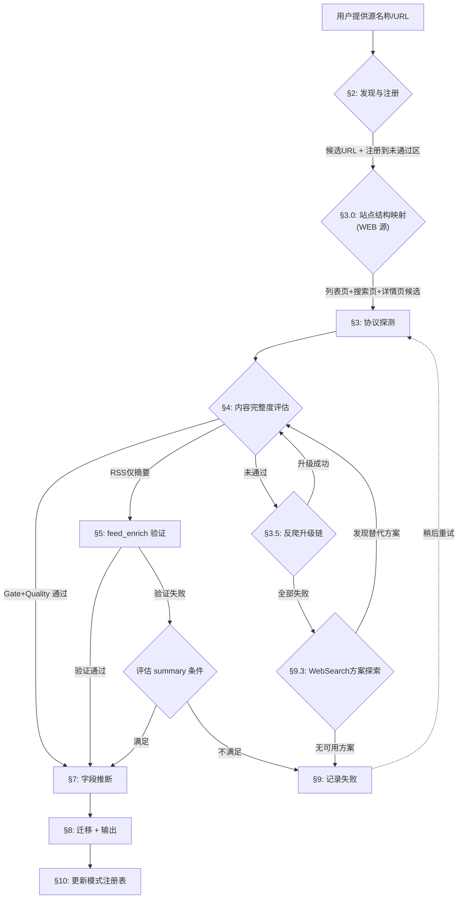

# Feed 数据源接入（Source Onboarding）

> 流程：前置知识 → 发现与注册 → **站点结构映射** → 协议探测 → 完整度评估 → feed_enrich → 选择器发现 → 字段推断 → 迁移输出 → 进化
> 进化机制：模式注册表 + 探测历史 + 自更新指令

## 快速参考流程图



**前置知识**见 [§1 前置知识速查](#1-前置知识速查)，完整规范见 `feedList_db.md §2-§4`

## 适用场景

- 用户提供新数据源 URL，需要测试并接入
- 批量测试未通过区的源，尝试重新验证
- 已知源需要从「未通过」迁移到对应 type 区
- 需要为已通过源保存采集样本

---

## §1 前置知识速查

以下为高频查用的核心规则。完整规范（子文档表格、测试留档、废弃区）见 `feedList_db.md §2-§4` 和 `references/note_dictionary.md`。

### 1.1 data_shape 分类与 ID 编码

<!-- SYNC: kind_boundary REPLICA data_shape内容边界，主表见feedList_db.md §2.1 -->

| data_shape | shape_code | ID范围 | 判定关键 |
|------------|------------|--------|---------|
| `text` | 1 | 10001-19999 | **人工编辑或 UGC 文本内容**（媒体文章+社交帖子+监管/官方文本发布） |
| `event` | 2 | 20001-29999 | **日期+事件**信息，不含数据内容；覆盖历史与未来 |
| `scalar` | 3 | 30001-39999 | 输出为 **(subject, subtype, date, value)** 的单值数值型数据 |
| `geo` | 4 | 40001-49999 | 含地理坐标/区域的地理空间数据 |
| `transaction` | 5 | 50001-59999 | 含买卖双方的交易/成交记录 |
| `ranked` | 6 | 60001-69999 | 输出为排名/评分列表的数据 |

**判定顺序**：日期事件（无数据内容）→ `event`；地理空间数据 → `geo`；交易记录 → `transaction`；排名列表 → `ranked`；单值数值时序 → `scalar`；其余文本内容（媒体+UGC+政府/监管/国际组织官方文本）→ `text`

> **probe_source.py 评估模式映射**：`text` shape 在探测脚本中通过 `--kind` 参数区分模式：`--kind news`（媒体文章，原 article，正文要求严格）、`--kind filing`（官方文本，原 filing）、`--kind social`（UGC，原 article 社交模式，正文要求宽松）。article/filing 均归入 `text` shape，但探测标准不同。

**ID编码**：`feedList_id = shape_code × 10000 + seq`

### 1.2 标识字段约束

<!-- SYNC: feedList_field REPLICA 字段定义，主表见feedList_db.md §3 -->

| 字段 | 格式约束 |
|------|---------|
| `feedList_id` | INT, PK, UNIQUE 跨 data_shape |
| `name` | `^[a-z_]+$`, UNIQUE 跨 data_shape |
| `prefix` | `^[A-Z]{4}$`, **全项目唯一**（跨全部 6 个 shape 表） |
| `status` | pending / designing / designed / developing / deployed |

---

## §2 发现与注册

### 2.1 发现（名称 → URL 候选列表）

**输入**：数据源名称（如 "Reuters"、"Financial Times"、"TradingEconomics"）

**输出**：候选 URL 列表 + 推荐 type

#### 两层发现架构

| 层 | 执行者 | 能力 | 适用场景 |
|----|--------|------|---------|
| **第 1 层** | Claude（WebSearch + WebFetch） | 语义搜索、跨域关联 | 名称模糊、需推理 |
| **第 2 层** | probe_source.py `--mode discover` | HTML link 解析、路径探测、CMS 识别 | 已知域名、批量验证 |

#### 第 1 层：Claude 智能发现

当用户仅提供源名称时，按以下步骤发现候选 URL：

1. **WebSearch 搜索**（并行发起 2-3 个搜索）：
   - `"{source_name}" RSS feed`
   - `"{source_name}" news API`
   - `site:{domain} rss OR feed OR atom`

2. **WebFetch 主域名**：抓取官网首页，提取：
   - `<link rel="alternate">` 标签中的 RSS/Atom URL
   - 页面中的 API 文档链接
   - CMS/框架标识（WordPress → /feed、Arc XP → /arcio/rss/）

3. **查阅模式注册表**：检查 `references/source_patterns.json`
   - `domain_shortcuts`：已知源的直接 URL 映射
   - `api_providers`：已知 API 供应商的端点模板
   - `cms_rss_paths`：CMS 平台 → RSS 路径映射

4. **编译候选列表**：合并所有发现的 URL，标注来源和置信度

#### 第 2 层：脚本批量发现

```bash
python3 probe_source.py --mode discover --url "https://example.com" --name "example" --kind news --output /tmp/discover.json
```

脚本自动执行 8 步：抓取主页→检测CMS→解析HTML link标签→CMS路径探测→扩展路径探测（从 `source_patterns.json` 加载）→已知源匹配→sitemap分析→验证所有候选

#### 发现 → 注册衔接

发现完成后，将候选列表呈现给用户确认后进入注册。

### 2.2 注册（加入未通过区）

#### 步骤

1. **确定 data_shape**：按 [§1.1 data_shape 分类](#11-data_shape-分类与-id-编码) 判定顺序分类
2. **分配 feedList_id**：读取目标 data_shape 文档（`docs/Feed/storage/feedList/{data_shape}.md`），扫描全文所有已用 ID，在该 data_shape 的 ID 范围内（如 text: 10001-19999）找到最小未使用 ID
3. **生成标识**：
   - `name`：全小写英文，无空格（可用下划线）
   - `prefix`：4位大写字母缩写
   - `name_cn`：中文名称
4. **确定 impact + authority**：
   - impact 15 / authority 15: 核心级（Bloomberg/Reuters/SEC）
   - impact 12-14 / authority 12-14: 主流高优（BBC/WSJ/央行）
   - impact 9-11 / authority 9-11: 区域/垂直重要
   - impact 5-8 / authority 5-8: 补充性
   - impact 1-4 / authority 1-4: 小众/实验性
5. **写入未通过区**：按 impact+authority DESC、feedList_id ASC 排序插入 `### 未通过` 表格，note 留空
6. **更新统计**：更新标题中的数量

#### 未通过区列格式

标准 data_shape：
```
| feedList_id | name | prefix | name_cn | impact | authority | note |
```

scalar/geo/transaction/ranked shape（多 subtype 列）：
```
| feedList_id | name | prefix | subtype | name_cn | impact | authority | note |
```

### 2.3 第三方镜像/桥接发现

**触发条件**：源自身域名的 RSS/API/WEB 全部探测失败（反爬封锁、需认证、SPA 无 SSR）。

**核心原则**：只接入能获取**最新数据**的镜像，历史归档不作为数据源（可作参考）。

#### 发现步骤

1. **WebSearch 搜索**（并行 2-3 个）：
   - `"{source_name}" RSS feed free`
   - `"{source_name}" scraping API alternative {current_year}`
   - `"{source_name}" mirror proxy open source`

2. **检查已知镜像服务**（查阅 `source_patterns.json → third_party_mirrors`）：
   - RSS 桥接：trumpstruth.org、RSSHub 实例
   - ActivityPub 桥接：bird.makeup
   - Embed/Syndication 端点：syndication.twitter.com
   - GitHub 归档（仅验证数据格式，不作为实时源）

3. **验证镜像可用性**：
   - HTTP 200 + 返回最新数据（**最新条目 ≤ 7 天**，否则不通过）
   - 包含正文内容（非仅标题/链接）
   - 无需认证

4. **评估稳定性**：
   - 官方服务（如 syndication.twitter.com）> 社区维护项目 > 个人项目
   - note 中标注 `第三方RSS镜像({domain})` 或 `Syndication端点`

#### 第三方源的 URL 记录

迁移时 URL 列填写**实际采集的第三方 URL**（非源官网），note 中标注第三方来源。

### 2.4 多 shape 拆分规则

**触发条件**：探测发现同一机构的 RSS/API 中混合了属于不同 data_shape 的内容。

**典型场景**：

| 混合模式 | 示例 | 拆分方案 |
|---------|------|---------|
| text + scalar | BOJ RSS 同时含 pdf 声明（text/filing模式）和 xlsx 统计数据（scalar） | 拆为两个独立源 |
| text + event | 央行 RSS 含政策声明（text/filing模式）和会议日程（event） | 拆为两个独立源 |
| text(news) + text(filing) | 政府网站同时有新闻稿（text/news模式）和政策文件（text/filing模式） | 同 shape 不拆分，用 subtype 区分 |

**拆分步骤**：

1. **识别混合**：探测时发现 RSS/API 条目按 data_shape 判定顺序（§1.1）归属不同 shape
2. **分别注册**：在各自 data_shape 的子文档中分配独立的 `feedList_id`、`name`（加后缀区分，如 `boj_text`/`boj_scalar`）、`prefix`（各自全项目唯一）
3. **分别探测**：每个拆分源独立完成协议探测→评估→迁移流程
4. **关联标注**：note 中标注 `拆分自{原名}；同机构另见{data_shape}#{feedList_id}`

**命名约定**：

| 原始名 | text 源（filing模式） | scalar 源 | 其他 shape |
|--------|----------------------|----------|-----------|
| `boj` | `boj` (保留，央行默认归 text/filing) | `boj_stat` (加 `_stat` 后缀) | 加对应后缀 |
| `imf` | `imf` | `imf_data` | — |

**判断标准**：只有当两种 data_shape 的内容**都有独立价值**且**可通过不同 URL/端点/过滤条件分别获取**时才拆分。如果只有一种 shape 有价值，另一种忽略即可。

---

## §3 协议探测

### 3.0 站点结构映射（WEB 源前置步骤）

**触发条件**：type=WEB 候选源，或 RSS/API 不可用需回退到 WEB 时。

**核心问题**：同一站点通常有多个入口路径（静态列表页、搜索端点、分类导航），它们在限流策略、内容覆盖、稳定性上差异显著。跳过此步直接探测单一 URL 会遗漏更优路径。

#### 为什么必须做

| 真实失败案例 | 原因 | 站点结构映射能发现 |
|-------------|------|------------------|
| ccgp.gov.cn 搜索端点触发 IP 限流 | 直接探测 search 子域 | 主站 `/cggg/dfgg/` 列表页无限流 |
| SPA 首页空壳误判不可达 | 只抓首页 | SSR 详情页或 POST API 端点 |
| 抓取列表页误存为详情页样本 | 未识别列表/详情页差异 | 明确列表页 → 详情页层级 |

#### 执行步骤

```
输入: 候选主域名 URL（如 https://www.example.gov.cn/）
  │
  ├─ Step 1: 抓取主页 → 提取导航链接
  │   解析 <nav>/<header> 区域的 <a href>
  │   提取所有一级路径（/announcements/, /search/, /news/）
  │
  ├─ Step 2: 分类页面角色
  │   每个候选 URL 归入以下角色之一：
  │   ┌──────────┬────────────────────────────────┐
  │   │ 角色      │ 识别特征                        │
  │   ├──────────┼────────────────────────────────┤
  │   │ 列表页    │ 含多条 <li>/<tr>/<article> 链接  │
  │   │          │ URL 含 index/list/archive       │
  │   │          │ 有分页组件（Pager/page_index）    │
  │   ├──────────┼────────────────────────────────┤
  │   │ 搜索页    │ 含 <form>/<input> 搜索框         │
  │   │          │ URL 含 search/query/bxsearch    │
  │   │          │ 支持参数过滤（日期/类型/关键词）    │
  │   ├──────────┼────────────────────────────────┤
  │   │ 详情页    │ 单条内容+结构化字段               │
  │   │          │ URL 含日期路径或 ID              │
  │   │          │ 无分页，有返回列表链接             │
  │   ├──────────┼────────────────────────────────┤
  │   │ 分类入口  │ 子分类导航（如 招标/中标/询价）     │
  │   │          │ 指向多个列表页                    │
  │   └──────────┴────────────────────────────────┘
  │
  ├─ Step 3: 评估入口路径
  │   对每个列表页/搜索页候选：
  │   - 抓取 1 次 → 检查是否返回有效内容（非空/非限流页）
  │   - 提取详情页链接数量（覆盖面）
  │   - 记录限流信号（403/"频繁访问"/CAPTCHA）
  │
  └─ Step 4: 选择最优采集入口
      优先级: 静态列表页（稳定、无限流）> 搜索端点（灵活但可能限流）
      记录所有可用入口（主路径 + 备选路径）
```

#### 入口选择矩阵

| 入口类型 | 优势 | 劣势 | 推荐场景 |
|---------|------|------|---------|
| **静态列表页** | 稳定、无限流、可预测 URL | 无法按关键词过滤 | 全量采集、政府/机构网站 |
| **搜索端点** | 支持过滤（日期/类型/关键词） | 可能 IP 限流、参数易变 | 按需查询、subscription 模式 |
| **分类导航** | 按业务分类天然分组 | 需遍历多个分类 | 多 bidType/公告类型的站点 |
| **RSS/Atom** | 标准格式、自动更新 | 可能仅摘要 | 有 RSS 的站点优先 RSS |

#### 代理可用性速查

站点结构映射时如发现限流，需评估代理是否可用：

| 域名类型 | DataImpulse 代理 | 原因 |
|---------|-----------------|------|
| `.gov` / `.gov.cn` / `.gov.uk` 等 | ❌ SITE_PERMANENTLY_BLOCKED | 住宅代理合规策略封锁政府域名 |
| `.edu` / `.mil` | ❌ 通常封锁 | 同上 |
| 商业站点 `.com` / `.cn` 等 | ✅ 可用 | 无合规封锁 |

> **经验**：政府网站被代理封锁时，优先寻找不限流的静态列表页路径，而非尝试其他代理。

#### 输出

站点结构映射的输出传递给 §3.1：

```
site_map:
  primary_entry: {url, type: listing|search, rate_limited: bool}
  fallback_entries: [{url, type, rate_limited}]
  detail_url_pattern: "{base}/{category}/{YYYYMM}/t{YYYYMMDD}_{id}.htm"
  categories: [{name, path, description}]
```

#### 跳过条件

以下情况可跳过站点结构映射：
- type=RSS 或 type=API 已有明确端点
- 用户已提供具体列表页/搜索 URL 且说明是最优路径
- 源在 `source_patterns.json → domain_shortcuts` 中已有验证过的入口

---

### 3.1 探测与选型原则

**核心规则**：内容层级（content_level）决定是否通过，通过后按 **API > RSS > WEB** 选型。content_level 定义见 [§4.1](#41-content_level-三级分类)。

```
探测顺序: RSS → API → WEB（并行或顺序均可）
选型优先: 正文完整的 API > 正文完整的 RSS（含 feed_enrich） > 正文完整的 WEB > 摘要级 RSS
淘汰规则: 所有协议都无法获取正文 + 摘要不满足 summary 级条件 → 未通过
CLI参数:  --shape {text|event|scalar|geo|transaction|ranked} 指定 data_shape
          --kind {news|filing|social|calendar|metric} 控制评估标准（与 --shape 配合使用）
          text shape 使用 --kind news（媒体）/--kind filing（官方文本）/--kind social（UGC）
          event shape 使用 --kind calendar；scalar/geo/transaction/ranked 使用 --kind metric
反爬回退: requests 遇 JS challenge(DataDome/Cloudflare/PerimeterX)
          → Playwright headless 重试 → 成功则 crawl_method=playwright
          → 仍失败则记录失败原因
```

**探测↔批量一致性约束**：

> 探测阶段（probe_source.py）和生产批量处理（feedSourceAdapter）使用**完全相同的反检测引擎栈**：
>
> | crawl_method | 探测阶段 | 批量处理 | 反检测基础设施 |
> |:------------:|---------|---------|--------------|
> | requests | probe_source.py `--mode web` | RequestsEngine | curl_cffi（Chrome TLS）+ browserforge（浏览器请求头） |
> | playwright | probe_source.py `--method playwright` | PlaywrightEngine | playwright-stealth（一行注入全部反检测） |
>
> 这意味着：**探测通过的 crawl_method 直接写入 feedList_db，无需二次验证或转换**。探测时 requests 能过的源，批量处理也一定能过（相同 TLS 指纹 + 相同请求头生成器）。
>
> 反检测三件套详见 `docs/Feed/sources/antiCrawl.md §1.3`

**强约束**：
- `type=WEB + crawl_mode=list_detail` 必须验证**文章详情页**，主页面/列表页探测结果仅作候选，不可直接留样。
- `type=RSS` 若仅摘要（无 full-text），优先尝试 [§5 feed_enrich 验证](#5-feed_enrich-rss-摘要增强路径)；验证失败后按 content_level 三级标准判定。

### 3.2 执行命令

```bash
# 单协议探测
python3 probe_source.py --mode rss --url "{URL}" --output /tmp/probe_rss.json
python3 probe_source.py --mode api --url "{URL}" --headers '{"Authorization": "Bearer xxx"}' --output /tmp/probe_api.json
python3 probe_source.py --mode web --url "{URL}" --selector ".article-body" --output /tmp/probe_web.json

# 全自动发现（--shape 指定 data_shape，--kind 控制评估标准，默认 news）
python3 probe_source.py --mode discover --url "{URL}" --shape text --kind filing --output /tmp/discover.json

# Playwright 回退（requests 遇反爬 JS challenge 时）
python3 probe_source.py --mode web --url "{URL}" --method playwright --output /tmp/probe_web_pw.json
```

### 3.3 可达性标准（HTTP 层）

| 模式 | 可达条件 | 失败特征 |
|------|---------|---------|
| RSS | HTTP 200 + 有效XML + ≥1 item + 含 title+link | 非XML / 无item / 仅title |
| API | HTTP 200 + 有效JSON + 非空数据数组 + 含正文或≥3字段 | 非JSON / 空数组 / 结构不可识别 |
| WEB(requests) | HTTP 200 + ≥200字正文 + 无硬paywall | **JS challenge → 触发 Playwright 回退** |
| WEB(playwright) | 页面加载完成 + ≥200字正文 + 无硬paywall | CAPTCHA需人工 / IP封锁 / 硬paywall |

**注意**：可达 ≠ 通过。可达但正文不完整的源按 content_level 三级标准判定（见 [§4.1](#41-content_level-三级分类)）：`full` 和 `summary` 可迁移，`minimal` 留未通过。

> **Playwright 触发条件**：仅当 requests 返回 DataDome/Cloudflare/PerimeterX 等 JS challenge 时自动回退，不用于所有 WEB 探测（避免不必要的浏览器开销）。

### 3.4 探测结果记录格式

```
成功："{type}可达；{内容描述}；{完整性等级}"
失败："{失败类型}（{具体原因}）"
Playwright成功："{type}可达（playwright）；{内容描述}；{完整性等级}"
Playwright失败："{失败类型}（playwright亦无法绕过：{原因}）"
```

### 3.5 反爬绕过升级链

**触发条件**：§3.1-3.3 标准探测失败（403/JS challenge/SPA 空壳/需认证）。

**核心原则**：按成本从低到高逐级升级，每级成功即停止；只追求**最新数据**的可达性。

#### 升级层级

| 层级 | 方法 | 成本 | 适用场景 | 示例 |
|------|------|------|---------|------|
| L0 | 官方公开 API | 零 | API 免费且无需认证 | HackerNews Firebase API |
| L1 | RSS/Atom 订阅 | 零 | 源自带 RSS 或 CMS 默认路径 | WordPress `/feed`、Arc XP `/arcio/rss/` |
| L2 | Embed/Syndication 端点 | 零 | 平台提供嵌入式内容端点 | `syndication.twitter.com`、YouTube oEmbed |
| L3 | 第三方 RSS 桥接 | 低 | 社区维护的 RSS 镜像服务 | RSSHub、trumpstruth.org |
| L4 | Playwright + playwright-stealth | 中 | 需 JS 渲染 / Cloudflare JS 质询 | SPA 站点、Cloudflare/Akamai |
| L5 | Playwright + stealth + 住宅代理 | 高 | L4 级反爬（DataDome/PerimeterX） | 地区封锁、行为分析型反爬 |
| L6 | 住宅代理 + 行为模拟 | 极高 | L5 仍失败，需完整行为模拟 | 几乎无法绕过，优先放弃 |

> **基线提升**：L0-L3 层的 requests 探测已内置 curl_cffi（Chrome TLS 指纹）+ browserforge（浏览器级请求头），原先因 TLS/请求头特征被拦截的基础限流站点现在可直接通过 requests 引擎。L4 层 Playwright 内置 playwright-stealth 插件，Cloudflare/Akamai JS 质询绕过率显著提升。

#### 执行流程

```
标准探测失败 → 分析失败原因
├── 403/JS challenge
│   ├── 检查是否有 RSS 替代（L1）
│   ├── 检查是否有 Embed/Syndication 端点（L2）
│   ├── WebSearch 查找第三方 RSS 桥接（L3）→ [§2.3]
│   ├── Playwright 重试（L4）
│   └── Playwright + 代理（L5）
├── SPA 空壳（无 SSR）
│   ├── 检查 __NEXT_DATA__ / JSON-LD（仍走 requests）
│   ├── 检查是否有 API 端点（L0）
│   └── Playwright 渲染（L4）
├── 需认证（401/OAuth）
│   ├── 检查是否有免费 tier
│   ├── 检查是否有 RSS 替代（L1）
│   └── 记录认证需求，标记未通过
└── 硬 Paywall
    ├── 检查 RSS 是否泄露全文（L1）
    └── 标记未通过
```

#### 升级决策规则

- **L6 不推荐**：DataDome/PerimeterX 绕过率极低，维护成本高于数据价值
- **同层级多方案时**：稳定性优先（官方端点 > 社区项目 > 个人项目）
- **升级前必查**：`source_patterns.json → anti_crawl_solutions` 中是否有已知方案
- **升级成功后**：note 中记录实际使用的层级方法（如 `Syndication端点`、`第三方RSS镜像`、`playwright`）

#### Playwright 探测实战经验

**基础 Playwright 探测脚本**（用于 SPA/JS 渲染站点）：

```python
from playwright.sync_api import sync_playwright
with sync_playwright() as p:
    browser = p.chromium.launch(headless=True, args=["--disable-blink-features=AutomationControlled"])
    page = browser.new_page()
    page.goto(url, timeout=30000, wait_until="networkidle")
    content = page.content()
    text = page.evaluate("document.body.innerText")
```

**API 拦截模式**（发现 SPA 背后的隐藏 JSON API）：

```python
api_responses = []
def handle_response(response):
    if response.status == 200 and "application/json" in (response.headers.get("content-type", "")):
        api_responses.append({"url": response.url, "size": len(response.body())})
page.on("response", handle_response)
page.goto(url, wait_until="networkidle")
# 分析 api_responses 发现隐藏端点
```

**已验证的 Playwright 探测结果分类**（2026-03 批量探测 15+ SPA 源）：

| 结果类型 | 典型表现 | 行动 | 示例 |
|---------|---------|------|------|
| POST 搜索 API | `<form>` POST 返回数据，无需 JS | **用 requests POST 直接采集** | HKEX titlesearch.xhtml |
| SPA 列表 + SSR 详情 | 列表页需 Playwright，详情页 SSR 可达 | **混合采集**：playwright(列表) + requests(详情) | ASIC |
| API 拦截成功但 curl 404 | Playwright 拦截到 JSON API，curl 直调 404 | **需 Playwright session 维持** | NFRA(nfra.gov.cn) |
| HTTP/2 协议封锁 | ERR_HTTP2_PROTOCOL_ERROR | **无法绕过**，记录失败 | CME、BusinessWire |
| Playwright 渲染仍为空 | innerText 0 字符 | **需深层 JS 调试或 API 逆向** | SFC HK |
| 超时 (>30s) | 页面加载超时 | **可能 IP 封锁或地理限制** | OCC、SEDAR+、IMF |

**关键经验**：
- SPA 探测优先尝试**绕过 SPA**（POST API、SSR 详情页）而非渲染 SPA
- `page.on("response")` API 拦截是发现隐藏端点的有效手段，但端点可能依赖 session cookie
- HTTP/2 协议级封锁（CME/BusinessWire）无法通过任何客户端手段绕过
- 查阅 `source_patterns.json → spa_hybrid_patterns` 获取已验证的混合采集模式

### 3.6 Subscription 源多目标质量测试

**触发条件**：`scope=subscription` 的源（按实体/账号订阅，如 Twitter per screen_name、SEC per CIK）。

**核心问题**：同一 API/端点对不同订阅目标可能返回不同质量的数据。

#### 测试矩阵

选取 **≥3 个代表性目标**，覆盖不同活跃度层级：

| 活跃度 | 选取标准 | 示例（Twitter） | 示例（SEC） |
|--------|---------|----------------|-------------|
| 高 | 日均发布 >20 条 | @Reuters, @DeItaone | AAPL (CIK 320193) |
| 中 | 日均发布 3-20 条 | @CNBC, @WSJ | TSLA (CIK 1318605) |
| 低 | 日均发布 <3 条 | @federalreserve, @SECGov | 小型公司 |

#### 质量分类

测试后按返回数据质量将目标分为三档：

| 档位 | 条件 | 行动 |
|------|------|------|
| **T1 优质** | 返回最新时序数据 + 正文完整 | 推荐订阅目标 |
| **T2 可用** | 返回数据但排序异常（如热门而非最新） | 可用但需注意排序 |
| **T3 不可用** | 返回空数据 / 需额外认证 / 被限流 | 该目标不可订阅 |

#### note 记录格式

```
scope=subscription(per {target_type})；{T1数量}个优质/{T2数量}个可用/{T3数量}个不可用
```

示例：`scope=subscription(per screen_name)；部分高量账号返回热门而非最新`

#### 与 §4 评估的关系

- Subscription 源的 Gate/Quality 评估**以 T1 档目标的响应为准**
- note 中记录质量差异，供下游调度器选择最佳目标

### 3.7 二进制文件处理（PDF/XLSX）

**触发条件**：RSS `<link>` 或 API 响应中的 URL 指向 `.pdf`、`.xlsx`、`.xls`、`.csv` 等非 HTML 文件。

**核心原则**：二进制文件是合法的内容载体，不应因为不是 HTML 就判定为"不可达"。按文件类型选择对应的提取工具评估内容完整度。

#### 文件类型 → 提取工具

| 文件类型 | 提取工具 | 下游处理 | 适用 data_shape |
|---------|---------|---------|----------------|
| `.pdf` | `pdftotext`（文本提取）或 PyMuPDF（结构化） | 文本 → feedAnalyzer NLP | text（声明/报告） |
| `.xlsx`/`.xls` | `openpyxl`（xlsx）或 `xlrd`（xls） | 表格 → (subject, date, value) | scalar（统计数据） |
| `.csv`/`.tsv` | `csv.reader` 或 `pandas` | 表格 → (subject, date, value) | scalar/geo/transaction/ranked |
| `.xml`（非 RSS） | `xml.etree` 或 `lxml` | 结构化数据提取 | text/scalar |

#### 探测流程

```
RSS item link → 检查 URL 后缀
├── .htm/.html → 标准 WEB 探测（§3.1）
├── .pdf → curl 下载 → pdftotext 提取 → 评估文本字符数/结构
├── .xlsx/.xls → curl 下载 → openpyxl/xlrd 解析 → 检查行列数+数值字段
├── .csv/.tsv → curl 下载 → 检查列数+行数+数值字段
└── 混合（同一 RSS 含多种后缀）→ 触发多 shape 拆分（§2.4）
```

#### 可达性标准（二进制文件）

| 模式 | 可达条件 | 失败特征 |
|------|---------|---------|
| PDF | HTTP 200 + `file` 命令确认 PDF + pdftotext 输出 ≥200 字符 | 非 PDF / 加密 / 扫描图片无 OCR |
| XLSX | HTTP 200 + openpyxl 可打开 + ≥1 sheet ≥5 行 + 含数值列 | 非 Excel / 密码保护 / 空表格 |
| CSV | HTTP 200 + ≥5 行 + ≥3 列 + 含数值列 | 空文件 / 格式错误 |

#### content_level 判定（二进制文件）

| 文件类型 | content_level=full 条件 | content_level=summary |
|---------|----------------------|---------------------|
| PDF（文本类） | pdftotext 输出 ≥500 字符 + 含实体/日期 | 200-500 字符 + impact+authority≥20 |
| PDF（表格类） | 含 ≥3 列数值数据 + 日期列 | — |
| XLSX | ≥5 行 × ≥3 列 + 含日期列 + 含数值列 | — |
| CSV | ≥5 行 × ≥3 列 + 含日期列 + 含数值列 | — |

#### crawl_method 映射

| 文件类型 | crawl_method | 说明 |
|---------|-------------|------|
| PDF（文本提取） | `pdf_extract` | 下游用 pdftotext/PyMuPDF 提取文本 |
| XLSX/XLS/CSV | `tabular_parse` | 下游用 openpyxl/pandas 解析表格数据 |

#### note 编码

| 场景 | note 格式 |
|------|----------|
| RSS→PDF 可提取 | `RSS link指向PDF；pdftotext可提取{N}字符` |
| RSS→XLSX 可解析 | `RSS link指向XLSX；{R}行×{C}列含数值时序` |
| RSS→混合文件类型 | `RSS混合内容：{N1}个PDF+{N2}个XLSX+{N3}个HTML；已拆分` |
| PDF 加密/扫描 | `PDF加密（需密码）` 或 `PDF为扫描件（无文本层）` |

#### 样本保存

二进制文件直接用 `curl -o` 保存原始文件：
```bash
# PDF 样本
curl -sL "{url}" -o samples/feed/{data_shape}/raw/{id}_{name}_pdf_{date}.pdf
# XLSX 样本
curl -sL "{url}" -o samples/feed/{data_shape}/raw/{id}_{name}_xlsx_{date}.xlsx
```

校验：`file {sample}` 确认文件类型正确 + 非空（`wc -c` > 0）。

---

## §4 内容完整度评估

### 4.1 content_level 三级分类

content_level 是贯穿评估→选型→迁移的**核心控制变量**。

| content_level | 判定标准 | 可迁移？ | crawl_mode |
|--------------|---------|---------|-----------|
| `full` | content:encoded 全文 或 feed_enrich 验证通过 | ✅ 迁移 | feed_only / feed_enrich |
| `summary` | desc ≥100字符 + 含实体/事件信号 + feed_enrich 不可行 + **impact+authority ≥ 20** | ✅ 迁移 | **feed_only**（仅消费摘要） |
| `minimal` | desc <100字符 或无 desc 或 impact+authority < 20 的纯摘要 | ❌ 未通过 | — |

**summary 级迁移条件**（全部满足）：
1. RSS 可达（HTTP 200 + ≥1 item + pubDate ≤90天）
2. description 平均 ≥100 字符（含核心事件+实体信号）
3. feed_enrich 已测试且不可行（Cloudflare/paywall/无正文）
4. impact+authority ≥ 20（信源权威性足以补偿内容深度不足）

**summary 级的下游限制**：摘要级源可支撑事件检测、实体关联、评分分流，但**不支撑 LLM 深度分析和因果图谱构建**。note 中标注 `content_level=summary`。

### 4.2 Gate + Quality 双层架构

**正文完整度判定**由 `evaluate_content_completeness(result, data_shape, kind)` 函数执行，返回：

```python
{
    "complete": bool,        # gates_passed AND score >= threshold
    "score": float,          # 0.0-1.0 quality score（仅 gate 全过时计算）
    "threshold": float,
    "gates_passed": bool,    # ALL gates True
    "gates": {               # 每个 gate 的通过状态
        "has_title": True,
        "has_content_source": True,
        ...
    },
    "signals": {             # 每个 quality signal 的得分
        "body_richness": 0.8,
        "structural_depth": 0.6,
        ...
    },
    "grade": "A",            # 从 score 派生
}
```

**双层原理**：

- **Gate（门槛层）**：下游 NOT NULL 字段的探针端映射。任一 gate 未通过 → `complete=False`，不计算质量评分。
- **Quality（质量层）**：仅 gate 全过时执行，`score = Σ(weight × signal_score) / Σ(weight)`，`score ≥ threshold` → `complete=True`。

**为什么分两层**：Gate 解决"能不能用"（has_title 权重 0.5 意味着标题可被字数补偿，但下游 feedAnalyzer NER 在无标题时必定降级）；Quality 解决"好不好用"。

**执行流程**：

```
输入 → Gate 层（ALL must pass）
  ├── 任一 gate 失败 → complete=False, grade=D, 不计算 quality
  └── 全部通过 → Quality 层（加权评分）
        score = Σ(weight × signal_score) / Σ(weight)
        score ≥ threshold → complete=True
        grade = _derive_grade(score)
```

### 4.3 Gate 定义

Gate 来源：feedLive_db NOT NULL 字段 + feedAnalyzer/feedScorer 的硬依赖。

#### Gate 类型

| gate_type | 语义 | 示例 |
|-----------|------|------|
| `bool` | `details[key]` 为真 | `has_title` |
| `or` | `details` 中任一 key 为真 | `has_content_tag OR has_description` |
| `gt` | `details[key] > min` | `char_count > 50` |
| `field_group_hit` | 指定字段组至少命中一个 | filing.id 组 |
| `freshness` | `days_since_update ≤ max_days` | `latest_pub_age ≤ 90` |

**新鲜度计算**：`days_since_update = now - max(channel.lastBuildDate, latest_item.pubDate)`；两者均无 → `∞` → gate 失败。

#### 完整 Gate 定义表（data_shape/kind × mode）

| data_shape | kind | mode | gates |
|------------|------|------|-------|
| text | news | rss | has_title(bool) + has_content_source(or: has_content_tag, has_description) + has_link(bool) + is_fresh(freshness: ≤90d) |
| text | news | api | has_content_source(bool: has_content_field) |
| text | news | web | has_title(bool) + has_content_source(gt: char_count>50) |
| text | filing | rss | has_title(bool) + has_identifier(bool: has_link) + is_fresh(freshness: ≤90d) |
| text | filing | api | has_identifier(field_group_hit: filing.id) |
| text | filing | web | has_title(bool) |
| event | calendar | rss | has_date(bool: has_pubdate) + has_event(bool: has_title) + is_fresh(freshness: ≤90d) |
| event | calendar | api | has_date(bool: has_date_field) + has_event(field_group_hit: calendar.event) |
| event | calendar | web | has_date(bool: has_time) |
| text | social | rss | has_content(bool: has_description) + is_fresh(freshness: ≤90d) |
| text | social | api | has_content(bool: has_content_field) |
| text | social | web | has_content(gt: char_count>5) |
| scalar | metric | api | has_numeric(bool: has_numeric_field) + has_date(bool: has_date_field) |

**说明**：scalar/geo/transaction/ranked shape 仅走 API（RSS/WEB 无配置 → 评估返回 empty → complete=False）。RSS 的 is_fresh gate 拦截已停更的 feed（如 WSJ RSS 停更于 2025-01，380天 > 90天阈值 → gate 失败）。

**二进制文件扩展**：当 RSS `<link>` 指向 PDF/XLSX 等非 HTML 文件时，gate 评估切换到对应的二进制文件标准（§3.7）。text/filing RSS 中的 PDF link 用 `pdftotext` 提取后按 text/filing/web gate 评估；XLSX link 按 scalar/metric/api gate 评估（触发多 shape 拆分 §2.4）。

### 4.4 Quality 信号与权重

Gate 过滤后，Quality 信号衡量"好不好用"。WEB 模式使用**多维信号矩阵**（经 15 篇真实金融新闻验证，准确率 100%）；RSS/API 模式使用传统信号。

#### 4.4.1 WEB 模式：多维信号矩阵

**设计原理**：单一字符阈值（如 ≥500 字）无法区分完整文章与 SPA 空壳/音频页/软截断。多维信号通过加权复合评分，允许强信号补偿弱信号，避免二元门控的级联误拒。

**评估前提**：多维信号必须在**提取正文区域后**计算，不可对全页面 HTML 评分。提取顺序：`crawl_content_selector` → `crawl_json_path`（`__NEXT_DATA__`/JSON-LD）→ readability 兜底。全页面含导航/侧栏/推荐文章的噪声段落会污染段落计数、CV 和自然结尾信号，导致完整文章误判为不完整（实测：21jingji 社论全页面 0.641 ❌ → 提取 `.content` 后 0.847 ✅）。

**4 个核心维度**（组权重 → 维度内信号均分）：

| 维度 | 组权重 | 子信号 | 说明 |
|------|--------|--------|------|
| **结构** | ×3 | `paragraph_count` | 段落数阶梯：≥10→1.0, ≥5→0.6+, ≥3→0.3+, <3→低 |
| | | `natural_ending` | 末尾内容段落以句号/引号结束（跳过 footer 样板文本，去除 Wikipedia `[N]` 引用标记） |
| | | `paragraph_structure` | 段落长度变异系数 CV：≤0.5→1.0, ≤0.8→0.6+, ≤1.2→递减, >1.2→0.0 |
| **语义** | ×3 | `entity_density` | 实体密度（人名/机构/数值/日期 per 100 词）：≥5→1.0, ≥2→0.5+, ≥1→0.3+ |
| | | `quote_attribution` | 引用+归因标记：blockquote(+0.4) + 引号话语(+0.3) + said/told/according(+0.3) |
| | | `topic_coherence` | 标题关键词在正文中的出现比例 |
| | | `title_quality` | 标题非错误页（检测 "not found"/"404"/"page unavailable"/"try searching" 等） |
| **反截断** | ×2 | `no_readmore` | 正文区域内无 "Read more"/"Continue reading" 标记（仅检测 `<p>` 和 `<article>` 内部，忽略 nav/footer） |
| | | `no_subscribe` | 正文区域内无 "Subscribe to read"/"Sign in to continue" |
| | | `no_paywall` | 无 paywall CSS class 标记 |
| | | `no_ellipsis` | 末段不以省略号结尾 |
| **字符辅助** | ×1 | `char_auxiliary` | 字符数辅助分：≥3000→1.0, ≥1000→0.5+, ≥200→0.2+（仅作平局裁决，非主判据） |

> **增益比维度**（×2 权重，仅 feed_enrich 场景启用）：见 [§5.4 gain_ratio 信号](#54-gain_ratio-信号)

**组内均分**：每维度 `score = mean(子信号)`，总分 `= Σ(组权重 × 维度score) / Σ(组权重)`。

**阈值 0.70**：完整文章天然聚集在 0.76-0.96 区间，不完整内容（SPA 壳/音频页/404）天然聚集在 0.19-0.67 区间，0.70 处存在 0.09 的天然间隙。

#### 4.4.2 RSS/API 模式：传统信号

| 信号 | 适用 mode | 权重 | 说明 |
|------|----------|------|------|
| `body_richness` | RSS/API | 0.5-3.0 | 正文字符数分段线性映射 |
| `structural_depth` | RSS | 2.0 | 段落数阶梯评分 |
| `field_coverage` | API | 3.0 | API 字段组覆盖率 |
| `no_truncation` | RSS | 1.0-2.0 | 无截断标记 |
| `item_consistency` | RSS | 1.0 | 条目长度变异系数低 |
| `data_freshness` | RSS | 2.0 | 最新条目距今天数（≤1d→1.0；1-7d→0.8；7-30d→0.5；30-90d→0.2） |
| `field_quality` | API | 1.0-2.0 | 空字段比例低 |
| `item_count` | RSS/API(social) | 0.5 | 条目数量充足 |

#### 完整信号配置（data_shape/kind × mode × threshold）

| data_shape | kind | mode | threshold | 信号体系 |
|------------|------|------|-----------|---------|
| text | news | web | **0.70** | **多维信号矩阵**（§4.4.1）：结构(×3)+语义(×3)+反截断(×2)+字符辅助(×1)，feed_enrich 时加增益比(×2) |
| text | news | rss | 0.45 | 传统：body_richness(3.0), data_freshness(2.0), structural_depth(2.0), no_truncation(2.0), item_consistency(1.0) |
| text | news | api | 0.40 | 传统：body_richness(3.0), field_quality(1.0) |
| text | filing | web | **0.70** | **多维信号矩阵**（§4.4.1） |
| text | filing | rss | 0.30 | 传统：body_richness(2.0), data_freshness(2.0), no_truncation(1.0) |
| text | filing | api | 0.45 | 传统：field_coverage(3.0), field_quality(2.0), has_date(1.0) |
| event | calendar | web | 0.30 | 传统：body_richness(1.5), has_title(1.0) |
| event | calendar | rss | 0.20 | 传统：data_freshness(2.0), body_richness(0.5) |
| event | calendar | api | 0.40 | 传统：field_coverage(3.0), field_quality(1.0) |
| text | social | web | 0.25 | 传统：body_richness(2.0) |
| text | social | rss | 0.30 | 传统：body_richness(2.0), data_freshness(2.0), item_count(0.5) |
| text | social | api | 0.30 | 传统：body_richness(2.0), field_quality(1.0), item_count(0.5) |
| scalar | metric | api | 0.40 | 传统：field_coverage(3.0), field_quality(1.0) |

### 4.5 评分函数库

**传统 scorer**（RSS/API 模式）：

| scorer 类型 | 公式 |
|------------|------|
| `length` | 分段线性：`<low→0.0`, `low→mid: 0.6×(v-low)/(mid-low)`, `mid→high: 0.6+0.4×(v-mid)/(high-mid)`, `≥high→1.0` |
| `bool` / `bool_inverse` | `True→1.0, False→0.0` / `False→1.0, True→0.0` |
| `ratio_inverse` | `≤good→1.0, ≥bad→0.0`, 线性插值 |
| `paragraph_depth` | RSS: 1→0.3, 3→0.7, 5→1.0 |
| `field_group_coverage` | `matched_groups / total_groups`（用 KIND_FIELD_PATTERNS） |
| `item_count_ratio` | `min(item_count / 5, 1.0)` |
| `freshness` | 分段阶梯：`≤1d→1.0, 1-7d→0.8, 7-30d→0.5, 30-90d→0.2, >90d→0.0` |

**多维信号 scorer**（WEB 模式 §4.4.1）：

| scorer 类型 | 公式 |
|------------|------|
| `paragraph_count` | ≥10→1.0, 5-10→0.6+线性, 3-5→0.3+线性, <3→`n×0.15` |
| `natural_ending` | 过滤 footer 样板段落 → 去除 `[N]` 引用标记 → 末段以 `.`/`!`/`?`/`。`/`."`结尾→1.0，以 `...`/`…` 结尾→0.0 |
| `cv_structure` | CV≤0.5→1.0, 0.5-0.8→0.6+线性, 0.8-1.2→递减至0, >1.2→0.0 |
| `entity_density` | 密度(per 100词)：≥5→1.0, 2-5→0.5+线性, 1-2→0.3+线性 |
| `quote_attribution` | blockquote(+0.4) + 引号话语(+0.3) + said/told/according(+0.3)，cap 1.0 |
| `topic_coherence` | `len(title_words ∩ body_words) / len(title_words)` |
| `title_quality` | 标题含 "not found"/"404"/"page unavailable"/"try searching" 等 → 0.0，否则 1.0 |
| `char_auxiliary` | ≥3000→1.0, 1000-3000→0.5+线性, 200-1000→0.2+线性 |

### 4.6 评级派生

评级由 quality score 自动派生（`_derive_grade`）：

| 等级 | quality score | 含义 |
|------|-------------|------|
| A | ≥ 0.85 | 下游全链路高质量可用 |
| B | ≥ 0.70 | 下游可用，部分信号缺失 |
| C | ≥ 0.25 | 勉强可用，建议补充 |
| D | < 0.25 | 不可用（或 gate 未通过） |

**complete 判定**：WEB 模式 `score ≥ 0.70`（B 级）→ `complete=True`；RSS/API 模式沿用各自 threshold（§4.4 表）。

### 4.7 选型决策矩阵

| 场景 | 行动 |
|------|------|
| API正文完整 + RSS正文完整 + WEB正文完整 | 选 API（最优先） |
| API不完整 + RSS正文完整 + WEB正文完整 | 选 RSS |
| API不完整 + RSS仅摘要 + WEB正文完整 | 触发 [§5 feed_enrich 验证](#5-feed_enrich-rss-摘要增强路径)；通过 → 选 RSS（feed_enrich）；失败 → 选 WEB |
| API不完整 + RSS不完整 + WEB正文完整 | 选 WEB |
| API不完整 + RSS仅摘要 + WEB不完整 | [§5 feed_enrich 验证](#5-feed_enrich-rss-摘要增强路径)；通过 → RSS（feed_enrich）；失败 → 评估 summary 迁移条件（§4.1） |
| 全部可达但正文均不完整 | 评估 summary 迁移条件（§4.1）；不满足 → **未通过** |
| 多个同类型都正文完整 | 优先 grade 最高；同级优先 html_link 来源 > path_probe |
| 全部以瞬态错误失败(429/503) | 延迟30秒重试一次，仍失败则记录 |

---

## §5 feed_enrich: RSS 摘要增强路径

### 5.1 概述与触发条件

**什么是 feed_enrich**：当 RSS 仅提供摘要（无 `content:encoded`）时，下游管道通过 `crawl_mode=feed_enrich` 跟随每条 RSS `<link>` 抓取完整正文。本节验证此路径是否可行，决定源能否以 feed_enrich 模式迁移。

**适用场景**：text shape（news/social 模式）中 80%+ 的 RSS 源仅有摘要。

**触发条件**：RSS gate 通过 + `content_source = "description"`（无 `content:encoded`）

**前置分流**：
```
RSS 含 content:encoded（全文）？
├── 是 → 直接 feed_only 迁移（不走本流程）
│         type=RSS, crawl_mode=feed_only, note="content:encoded含完整文章；纯RSS即可"
└── 否（仅 description 摘要）→ 进入以下 feed_enrich 验证
```

**与评估体系的关系**：feed_enrich 验证是 Gate+Quality 之后的**补充评估**：

```
RSS 探测 → Gate 层（§4.3）
├── gate 未通过 → complete=False（直接不可用）
└── gate 通过 → Quality 层（§4.4）
    ├── content_source = "content_encoded" → content_level=full, crawl_mode=feed_only
    └── content_source = "description" → 触发 feed_enrich 验证（本节）
        ├── 验证通过 → content_level=full, crawl_mode=feed_enrich
        └── 验证失败 → 评估 summary 条件（§4.1）
            ├── desc≥100字符 + 含实体信号 + p≥10 → content_level=summary, crawl_mode=feed_only
            └── 不满足 → content_level=minimal, 留未通过区
```

### 5.2 验证流程

```
Step 1: RSS 新鲜度检查
  curl -L -o /tmp/{name}_rss.xml "{RSS_URL}"
  验证: item数 ≥1, pubDate ≤90天, 无content:encoded
  ↓ 通过
Step 2: feed_enrich 验证（5篇文章 link）
  随机抽5条 <item> 的 <link>
  逐一 curl -L -o + 选择器提取正文字符数（-L 跟随 301/302 重定向）
  通过条件: ≥3/5 正文多维信号评分 ≥0.70（§4.4.1）+ 无硬paywall
  ↓ 通过
Step 3: 选择器发现（见 §6）
  优先级: 标准class → data属性 → <article>标签 → div直接文本
  记录命中率最高的选择器
  ↓ 确定
Step 4: 双样本保存（见 §5.5）
  RSS: xmllint --format → {id}_{name}_rss_{date}.xml + xmllint --noout
  Web: curl -o 详情页 → {id}_{name}_web_{date}.html + grep </body>
  ↓ 验证通过
Step 5: 迁移（见 §8.6 迁移检查模板）
  RSS区插入 → 未通过区删除 → 标题计数 → 统计表 → mermaid → country
```

#### 执行方式

**脚本自动验证**（推荐）：
```bash
# discover 模式自动触发：RSS 仅摘要时脚本内部执行 feed_enrich 验证
python3 probe_source.py --mode discover --url "{URL}" --kind news --output /tmp/discover.json
# 输出中 recommended.feed_enrich_verified = true/false
```

**手动验证**（逐步确认）：
```bash
# 1. RSS 探测，确认仅摘要
python3 probe_source.py --mode rss --url "{RSS_URL}" --output /tmp/rss.json
# 查看 details.content_source == "description"

# 2. 从 RSS 样本提取 item link（jq 示例）
jq -r '.details.sample_links[:5][]' /tmp/rss.json

# 3. 逐一 WEB 探测
python3 probe_source.py --mode web --url "{item_link}" --output /tmp/web_enrich_1.json
```

#### 关键判断点

| 步骤 | 失败条件 | 行动 |
|------|---------|------|
| Step 1 | pubDate >90天 或 RSS 404 | 主语言版 404 先检查其他语言版 RSS；仍无则尝试 WEB |
| Step 2 | <3/5 正文可达（paywall/403/空） | 维持未通过，更新 note |
| Step 3 | 无可用选择器 | 用 readability（selector=`-`） |

### 5.3 结果处理矩阵

| 验证结果 | content_level | crawl_mode | 可否迁移 |
|---------|--------------|-----------|---------|
| ≥60% link 正文可达 | `full` | `feed_enrich` | ✅ 迁移为 type=RSS |
| link 正文可达但需 playwright | `full` | `feed_enrich` | ✅ 迁移，note 加 `link需playwright` |
| <60% link 可达 + desc≥100字符 + p≥10 | `summary` | `feed_only` | ✅ 迁移为 type=RSS（仅消费摘要） |
| <60% link 可达 + desc<100字符 或 p<10 | `minimal` | - | ❌ 留未通过区 |
| link 全部 paywall/403 + desc≥100字符 + p≥10 | `summary` | `feed_only` | ✅ 迁移为 type=RSS（仅消费摘要） |
| link 全部 paywall/403 + desc<100字符 或 p<10 | `minimal` | - | ❌ 留未通过区 |

### 5.4 gain_ratio 信号

**仅 feed_enrich 场景**中，多维信号矩阵增加第 5 个维度：

| 维度 | 组权重 | 子信号 | 说明 |
|------|--------|--------|------|
| **增益比** | ×2 | `gain_ratio` | web正文句数 / RSS摘要句数（≥10→1.0, ≥5→0.6+），无 RSS 基线时不参与计算 |

**scorer 公式**：句数比(web/rss)：≥10→1.0, 5-10→0.6+线性, 2-5→0.3+线性

启用时总分公式变为：`Σ(组权重 × 维度score) / Σ(组权重)`，其中组权重包含结构(×3)+语义(×3)+反截断(×2)+增益比(×2)+字符辅助(×1) = 总权重 11。

### 5.5 双样本保存要求

`crawl_mode=feed_enrich` 的源须保存**两份样本**：
1. RSS 样本：`{id}_{name}_rss_{date}.xml`（证明 RSS 可达）
2. Web 详情页样本：`{id}_{name}_web_{date}.html`（证明跟随 link 正文可达）

Web 详情页样本须通过结构校验（`</body>` 存在 + 命中 `crawl_content_selector`）

### 5.6 note 编码

feed_enrich 相关的 note 短语：

| 场景 | note 格式 |
|------|----------|
| 验证通过（有 selector） | `摘要~{N}字；跟随link正文可达({M}/{T})；selector={sel}` |
| 验证通过（readability） | `摘要~{N}字；跟随link正文可达({M}/{T})` |
| 验证通过（需 playwright） | `摘要~{N}字；link正文需playwright` |
| 验证失败 | `RSS仅摘要~{N}字；link正文不可达({reason})` |
| summary 级迁移 | `content_level=summary；摘要~{N}字` |
| summary + 原因 | `content_level=summary；摘要~{N}字；Cloudflare封锁正文` |

---

## §6 CSS 选择器发现

**触发条件**：feed_enrich（§5）或 WEB 探测（§3）时需确定 `crawl_content_selector`。

**核心原则**：按优先级逐级尝试，命中即停止。每级的验证标准：提取后多维信号评分 ≥ 0.70（§4.4.1）。

### 6.1 发现优先级

| 优先级 | 类型 | 搜索方法 | 示例 |
|--------|------|---------|------|
| **P1** | 标准 class（含 `article`/`content`/`body`/`story`/`text`/`post`） | `re.findall(r'class="([^"]*)"')` → 过滤含关键词的 class → 提取 `<p>` | `.article-body`(Kyodo), `.ArticleBody`(CNBC), `.story-news`(Yonhap) |
| **P2** | data 属性 | `re.findall(r'data-component="([^"]*)"')` 或 `data-testid` | `[data-component="text-block"]`(BBC) |
| **P3** | `<article>` 标签 | `re.findall(r'<article[^>]*>(.*?)</article>')` → 取文本最多的 article | `<article>` 标签(Guardian, Korea Herald) |
| **P4** | div 直接文本（无 `<p>` 标签） | 在 P1-P3 命中的容器内，`re.sub('<[^>]+>', ' ', html)` 取纯文本 | `.post-content`(Antara, div直接文本) |
| **P5** | JSON-LD `articleBody` | `<script type="application/ld+json">` → `data['articleBody']` | 仅当 articleBody 长度与 wordCount 一致时可信 |
| **P6** | readability 降级 | 无法确定选择器时用 `-` 表示 readability | `-`(readability 自动提取) |

### 6.2 JSON-LD 反模式（已知陷阱）

| 反模式 | 表现 | 示例 |
|--------|------|------|
| articleBody 是 CSS class 名 | 值为短字符串（<50字），实为 class 引用 | CNBC: `"articleBody": "App-articleBody"` |
| articleBody 截断 | 值存在但远短于 wordCount 声明 | Japan Times: 313-940字 vs wordCount=775 |
| articleBody 缺失 | JSON-LD 有 NewsArticle 但无 articleBody 字段 | Guardian: 有 JSON-LD 但无 articleBody |

**验证规则**：JSON-LD articleBody 长度 ≥ `wordCount × 4`（英文平均词长）时才可信。

### 6.3 `<article>` 标签特殊处理

- 页面可能有多个 `<article>` 标签（如 Korea Herald index-0 为空壳）
- **取文本量最大的 article**：`max(articles, key=lambda a: len(text_content(a)))`
- article 内可能无 `<p>` 标签（如嵌套 div），此时退回 P4 div 文本提取

### 6.4 已知选择器速查表

| 平台/CMS | 典型选择器 | 已验证源 |
|----------|-----------|---------|
| Arc XP | `.article-body`, `.content-elements` | Reuters, El Comercio |
| WordPress | `.entry-content`, `.post-content` | 多数 WordPress 站 |
| Next.js | `__NEXT_DATA__` JSON path | WSJ, The Paper, Nikkei |
| BBC | `[data-component="text-block"]` | BBC News |
| ASP.NET | `.article-paragraph-wrap` | Jerusalem Post |
| Antara CMS | `.post-content`（div 直接文本，非 `<p>`） | Antara News |
| 通用 SSR | `<article>` 标签 | Guardian, Korea Herald, CFR |

### 6.5 note 中选择器的编码

| 选择器类型 | note 格式 |
|-----------|----------|
| 标准 CSS class | ``selector=`.article-body` `` |
| data 属性 | ``selector=`[data-component="text-block"]` `` |
| HTML 标签 | ``selector=`<article>`标签`` |
| div 直接文本 | ``selector=`.post-content`(非p标签，div直接文本)`` |
| readability | 不写 selector 或写 `-` |

---

## §7 字段推断

探测通过后，脚本自动推断以下隐藏字段值，确保与 feedSourceAdapter 爬虫体系匹配。

<!-- SYNC: feedList_field REPLICA 字段推断规则，主表见feedList_db.md §3 -->

### 7.1 D 组：爬取字段（type=WEB/RSS）

| 字段 | 推断规则 |
|------|---------|
| `crawl_method` | requests（SSR 可达）/ playwright（需 JS 渲染或 L3-L4 反爬）/ scrapy（仅 crawl_range=full 时）/ pdf_extract（RSS link 指向 PDF，用 pdftotext/PyMuPDF 提取）/ tabular_parse（RSS link 指向 XLSX/CSV，用 openpyxl/pandas 解析） |
| `crawl_mode` | feed_only（type=RSS，RSS全文无需补全）/ feed_enrich（type=RSS，RSS摘要+跟随link抓正文，判定见 [§5.3](#53-结果处理矩阵)）/ list_detail（WEB 默认，首页有文章链接）/ list_only（社交/指标，列表页即完整数据） |
| `crawl_content_selector` | 探测时验证有效的 CSS 选择器（见 [§6](#6-css-选择器发现)）；NULL 则用 readability |
| `crawl_list_selector` | 列表页提取文章 URL 的选择器；NULL 则回退到 `a[href]` + URL 模式过滤 |
| `crawl_json_path` | Next.js → `__NEXT_DATA__` 路径；JSON-LD → `articleBody`；否则 NULL |
| `crawl_exclude_selector` | 常见噪声选择器（广告/相关文章/评论区） |
| `crawl_use_proxy` | 0（默认）/ 1（EU封锁/住宅代理/L3-L4反爬） |
| `crawl_range` | latest（默认实时采集）/ full（历史全量）/ incremental（增量续采） |
| `max_pages` | 从列表页分析得出合理值（默认 10） |

**crawl_method 决策树**：

> **底层实现**：`requests` 引擎内部使用 curl_cffi（Chrome TLS 指纹）+ browserforge（浏览器级请求头），`playwright` 引擎内部使用 playwright-stealth 插件。探测和批量处理使用相同引擎栈（见 [§3.1 一致性约束](#31-探测与选型原则)）。

```
RSS link 指向什么类型的文件？
├── .pdf → crawl_method = pdf_extract（pdftotext/PyMuPDF 提取文本）
├── .xlsx/.xls/.csv → crawl_method = tabular_parse（openpyxl/pandas 解析表格）
│   └── 触发 data_shape 判定：表格数值数据 → scalar（可能需多 shape 拆分 §2.4）
├── .htm/.html 或无后缀 → 标准 HTML 探测：
│   requests（curl_cffi + browserforge）探测成功？
│   ├── 是 → crawl_method = requests
│   │   ├── 含 __NEXT_DATA__ → 记录 crawl_json_path
│   │   ├── 含 JSON-LD articleBody → 记录 crawl_json_path
│   │   └── 纯 HTML → 记录 crawl_content_selector
│   └── 否 → 分析失败原因
│       ├── Cloudflare/Akamai JS质询 → playwright（+ playwright-stealth 自动注入）
│       ├── DataDome/PerimeterX → playwright + stealth + 住宅代理
│       ├── SPA/JS 渲染（非反爬） → playwright
│       └── 硬 403/paywall → 未通过
└── 混合（同一 RSS 含 PDF+XLSX+HTML）→ 按 shape 拆分（§2.4），各子源分别赋值
```

**crawl_mode 推断**：

| 条件 | crawl_mode |
|------|-----------|
| type=RSS + content:encoded含完整文章 | `feed_only` |
| type=RSS + 仅摘要 + feed_enrich验证通过（[§5](#5-feed_enrich-rss-摘要增强路径)） | `feed_enrich` |
| type=RSS + 仅摘要 + feed_enrich验证失败 | 不分配（留未通过区） |
| type=WEB + 有文章链接列表 | `list_detail` |
| type=WEB + 列表页内容已完整 | `list_only` |
| type=API | 不适用（走 G 组） |

### 7.2 E 组：登录字段（login_requires=1 时激活）

| 字段 | 推断规则 |
|------|---------|
| `login_requires` | 0（默认）/ 1（付费墙+有凭据 / OAuth2） |
| `login_method` | form / oauth2 / api_key / basic_auth |
| `login_url` | 登录页面 URL（form 时必填） |
| `login_name` / `login_password` | 用户提供（不主动猜测） |
| `oauth_token_url` / `oauth_client_id` | OAuth2 时必填 |

### 7.3 F 组：Cookie 字段（type=WEB 或 login_requires=1）

| 字段 | 推断规则 |
|------|---------|
| `cookie_user_agent` | NULL / 特定 UA（如 SEC 要求声明身份） |
| `cookie_headers` | NULL / JSON 对象（如 CLS 需要 Referer+UA） |
| `cookie_refresh_method` | manual（默认）/ auto_login / browser |
| `cookie_refresh_interval` | 86400（默认 1 天） |

### 7.4 G 组：API 字段（type=API）

| 字段 | 推断规则 |
|------|---------|
| `api_provider` | 从 URL 域名推断供应商名 |
| `api_key_ref` | Secret 引用名（非明文），格式 `{provider}_api_key` |
| `api_auth_method` | none / api_key / bearer / oauth2 / basic |
| `pagination_type` | 从探测响应推断（见下表） |

**api_auth_method 推断**：

| 探测发现 | api_auth_method |
|---------|----------------|
| 无参数直接 200 | `none` |
| URL含 ?apikey= 或需 key | `api_key` |
| 401 + Bearer scheme | `bearer` |
| 401 + Basic realm | `basic` |
| 已知需 OAuth2 | `oauth2` |

**pagination_type 推断**：

| 探测发现 | pagination_type |
|---------|----------------|
| 响应含 `next_url` / `next` 链接 | `cursor` |
| 响应含 `nextPageToken` / `page_token` | `token` |
| URL 含 `?offset=` / `?start=` | `offset` |
| URL 含 `?page=` / `?p=` | `page` |
| 单次返回全部数据（无分页字段） | `none` |
| 无法判断 | `NULL` |

### 7.5 C 组：调度字段

| 字段 | 推断规则 |
|------|---------|
| `scope` | broadcast（默认）/ subscription（按实体订阅，如 SEC per-CIK） |
| `trigger` | scheduled（绝大多数源） |
| `poll_interval_sec` | 按 impact+authority 之和：≥28→60s, 20-27→300s, 16-19→900s, 8-15→3600s, <8→86400s |

### 7.6 B 组：去重字段

| 字段 | 推断规则 |
|------|---------|
| `dedup_key_hint` | 从探测响应的数据结构推断（见下表） |

**dedup_key_hint 推断**：

| 探测发现 | dedup_key_hint |
|---------|----------------|
| RSS 含 `entry.link` | `url` |
| API 响应含 `id` 字段（整数/字符串唯一ID） | `id` |
| SEC EDGAR 端点 | `accession_number` |
| 社交平台含 `post_id` / `tweet_id` | `post_id` |
| 日历 API 含 symbol+date 但无唯一 ID | `symbol+date+type` |
| metric API 含 entity+date 但无唯一 ID | `entity+date+metric` |
| WEB 源 | `url`（默认） |
| 无法判断 | `NULL`（用 data_shape 默认策略） |

---

## §8 迁移与输出

### 8.0 data_shape 归属校验（迁移前置）

> **强约束**：迁移前必须校验数据源实际输出是否匹配当前 data_shape。探测/分析过程中发现 data_shape 归属错误时，**必须先告知用户并获得同意后才能跨 shape 迁移**。

**触发条件**：探测结果的数据特征与当前 data_shape 定义（[§1.1](#11-data_shape-分类与-id-编码)）不符。

| 发现信号 | 当前 data_shape | 应归 data_shape | 说明 |
|---------|----------------|----------------|------|
| 输出为 (subject, subtype, date, value) 单值数值型 | text/event | scalar | 数值时序数据 |
| 输出含地理坐标/区域 | text/scalar | geo | 地理空间数据 |
| 输出含买卖双方的交易记录 | text/scalar | transaction | 交易记录 |
| 输出为排名/评分列表 | text/scalar | ranked | 排名列表 |
| 输出仅含日期+事件，不含数据内容 | text/scalar | event | 日历事件 |
| 输出为文本内容（媒体/官方/UGC） | event/scalar | text | 文本内容 |

**操作流程**：

```
探测完成 → 校验数据特征 vs 当前 data_shape
├── 匹配 → 继续 §8.1
└── 不匹配 → 记录到 shape_mismatch 列表，继续处理下一个源

当前批次全部验证完成后：
├── shape_mismatch 为空 → 正常结束
└── shape_mismatch 非空 → 统一报告所有错配
    → 格式："{name} 当前在 {current_shape}，实际输出为 {特征描述}，建议归入 {target_shape}"
    → 逐条等待用户确认
    ├── 用户同意 → 跨 shape 迁移（§8.0.1）
    └── 用户拒绝 → 保持当前 data_shape，按用户指示处理
```

> **要点**：错配源在当前批次中仍按原 data_shape 完成验证流程（§8.1→§8.5），仅在批次结束后才处理迁移。

#### 8.0.1 跨 shape 迁移步骤

1. **从原 data_shape 文档删除该行**（未通过区或已通过区，不保留到废弃区）
2. **在原 data_shape 文档更新统计**（标题数量、subtype 统计表、chart）
3. **分配新 feedList_id**（目标 data_shape 的 ID 范围内最小未使用 ID，旧 ID 自然释放）
4. **在目标 data_shape 文档的未通过区注册**（使用新 feedList_id）
5. **从 §3 重新探测**（目标 data_shape 可能有不同的 content_level 标准）

> **注意**：跨 shape 迁移涉及 feedList_id 变更，必须同步更新已有样本文件名。

### 8.1 选择最佳 type

按 [§4.1 content_level](#41-content_level-三级分类) 和 [§4.7 选型决策矩阵](#47-选型决策矩阵) 执行。核心规则：

- `content_level=full`：按 **API > RSS > WEB** 选型
- `content_level=summary`：仅以 `crawl_mode=feed_only` 迁移为 RSS
- `content_level=minimal`：不可迁移

### 8.2 迁移表格行

1. **从未通过区删除该行**
2. **在对应 type 区追加该行**（按 impact+authority DESC 插入正确位置）
3. **设置 `status` 为 `designed`**

#### type=WEB 行格式
```markdown
| {id} | {name} | {prefix} | {name_cn} | {impact} | {authority} | designed | [url]({actual_url}) | {login_url或-} | `{selector}` | {note} |
```

- `login_url`：无登录需求填 `-`；有凭据用 `[login_url](url "user / pass")` 格式
- `crawl_content_selector`：探测验证有效的选择器用反引号；无则填 `-`（readability）
- `note` **必须包含**：渲染技术 + 内容描述 + crawl_json_path（如有）+ 列表页信息 + 反爬/paywall状况

#### type=RSS 行格式
```markdown
| {id} | {name} | {prefix} | {name_cn} | {impact} | {authority} | designed | [url]({rss_feed_url}) | {note} |
```

- `note` **必须包含**：RSS格式变体 + 内容完整度 + 二次Web抓取可行性 + 语言

#### type=API 行格式
```markdown
| {id} | {name} | {prefix} | {name_cn} | {impact} | {authority} | designed | {provider} | {note} |
```

- `note` **必须包含**：api_auth_method + 响应格式 + 关键字段 + 分页机制

编写 note 时查阅 `references/note_dictionary.md` 获取完整编码词典。

### 8.3 保存采集样本

```bash
cp /tmp/probe_{type}.{ext} samples/feed/{data_shape}/raw/{feedList_id}_{name}_{type}_{YYYYMMDD}.{ext}
```

样本格式化：JSON → `json.dump(indent=4)`、XML/RSS → `xmllint --format`、HTML → prettier

**原始文件完整性**：样本保持服务器返回的完整内容，不截断不修改。禁止使用 Claude 的 Write 工具保存 HTML（受模型输出 token 上限约束会截断），必须通过 `curl -o`、`probe_source.py` 或 Bash 的 `cp`/`mv` 保存。

**保存后强制结构校验**：
- JSON/API：`jq empty {sample}.json`
- RSS/XML：`xmllint --noout {sample}.xml`
- WEB/HTML：至少满足 `</body>` 存在，且命中正文信号（`crawl_content_selector` / `articleBody` / `__NEXT_DATA__`）
- **截断快速判定**：文件恰好 51200 字节（50KB）或 50000 字节 → 几乎必定是 Write 工具截断，须用 `curl -o` 重新保存
- **`__NEXT_DATA__` 源专项校验**（`crawl_json_path=__NEXT_DATA__` 时追加）：
  1. `page` 字段不为 `"/"`（排除首页/列表页）
  2. JSON 中存在 body/articleBody/content 字段且 clean text ≥200 字符
  3. 验证命令：`python3 -c "import re,json; ... print(page, len(body))"` 确认非首页且正文存在

**WEB 样本内容要求**：
- `crawl_mode=list_detail` 的源：样本必须是**文章正文详情页**，不能是网站首页/列表页。先从首页提取一条文章链接，再 `curl -o` 抓取该文章页。
- `crawl_mode=list_detail` 的源：若页面包含大量文章链接但正文字符短（列表页特征），判为无效样本并重抓详情页。
- `crawl_mode=list_only` 的源（社交/指标）：样本为列表页本身。

> feed_enrich 源的双样本保存要求见 [§5.5](#55-双样本保存要求)

### 8.5 更新统计

更新 type 区和未通过区标题中的数量。

### 8.6 迁移操作检查模板

**每次迁移一个源时，按以下顺序执行 Edit 操作**（防遗漏）：

```
□ 1. 在目标 type 区正确位置插入新行
      → 按 impact+authority DESC, feedList_id ASC 排序
      → status = designed
      → note 包含所有隐藏字段编码

□ 2. 从未通过区删除该行
      → 确认 feedList_id 正确
      → 检查删除后无空行残留

□ 3. 更新 type 区标题计数
      → ### type=RSS（N个） → N+1

□ 4. 更新 subtype 统计表
      → 对应 subtype 行：已通过 +1, 未通过 -1
      → 典型站点列表如需更新

□ 5. 更新总计行
      → 已通过 +1, 未通过 -1, 合计不变

□ 6. 更新 mermaid chart bar
      → 第二组 bar 中对应 subtype 位置 +1
      → x-axis 标签顺序：financial, regional, ugc, general,
        industry, tech, wire, political, investment, crypto

□ 7. 更新 country sankey（如需）
      → 新增国家：添加 "Subtype","Country",N 行
      → 已有国家：数量 +1
      → 新 country 标签：添加到对照表
```

**text shape（news/social模式）country 编码速查**：

| 编码 | 国家/地区 | 编码 | 国家/地区 |
|------|----------|------|----------|
| US | 美国 | CN | 中国 |
| UK | 英国 | JP | 日本 |
| EU | 欧洲 | KR | 韩国 |
| IL | 以色列 | HK | 香港 |
| TW | 台湾 | CA | 加拿大 |
| INTL | 国际 | ASEAN | 东南亚 |
| LATAM | 拉美 | Other | 其他 |

---

## §9 失败处理与批量操作

### 9.1 失败原因记录

在未通过区 note 列填写失败原因：

| 失败类型 | note 格式示例 |
|---------|-------------|
| 反爬拦截 | `Cloudflare 403` |
| 高级反爬 | `DataDome CAPTCHA；需住宅代理+Playwright` |
| 付费墙 | `硬Paywall "Subscribe to read"` |
| SPA 无 SSR | `SPA骨架屏无内容，需JS渲染` |
| 需认证 | `API需OAuth2 Bearer Token` |
| 端点失效 | `RSS返回404` |
| 内容不足 | `RSS仅title+link，无description` |

### 9.2 批量操作规范

多个源时使用 Task 工具并行探测（最多 3 个并发）。

**失败处理**：若批量中 >50% 失败，暂停检查共性原因（IP限速、网络问题）再继续。

汇总报告格式：

```markdown
| # | name | RSS | API | WEB | 推荐type | 完整性 | 行动 |
|---|------|-----|-----|-----|---------|--------|------|
| 1 | xxx  | ✅A  | ❌   | ✅B  | RSS     | A      | 迁移 |
| 2 | yyy  | ❌   | ❌   | ❌   | -       | D      | 记录 |
```

用户确认后批量执行迁移。

### 9.3 WebSearch 驱动的方案探索

**触发条件**：§3.5 反爬升级链全部失败，或标准探测返回的数据无法满足时效性要求。

**核心原则**：利用 WebSearch 的语义搜索能力发现非显而易见的替代方案（第三方镜像、社区项目、非官方 API）。

#### 搜索策略

并行发起 2-3 个搜索，覆盖不同发现路径：

| 搜索模板 | 发现目标 | 示例 |
|---------|---------|------|
| `"{source_name}" RSS feed free {year}` | 第三方 RSS 桥接 | 发现 trumpstruth.org |
| `"{source_name}" API alternative scraping {year}` | 替代 API/爬取方案 | 发现 syndication.twitter.com |
| `"{source_name}" open source data mirror` | 开源数据镜像 | GitHub 归档项目 |
| `site:github.com "{source_name}" RSS OR feed OR scraper` | 社区工具 | RSSHub 规则、爬虫项目 |

**关键**：搜索查询中包含 `{current_year}` 确保结果时效性。

#### 评估发现的方案

对每个搜索结果按以下标准评估：

| 评估维度 | 通过条件 | 淘汰条件 |
|---------|---------|---------|
| **时效性** | 最新数据 ≤ 7 天 | 仅历史归档 |
| **内容完整度** | 含正文/结构化数据 | 仅标题/链接 |
| **可达性** | HTTP 200 + 无需认证 | 需付费/OAuth |
| **稳定性** | 官方服务或活跃维护项目 | 个人项目/已停更 |

#### 方案发现后的处理

```
WebSearch 发现可用方案
├── 第三方 RSS → 回到 §3 RSS 探测 → §4 评估
├── 替代 API → 回到 §3 API 探测 → §4 评估
├── 替代 WEB 端点 → 回到 §3 WEB 探测 → §4 评估
└── 无可用方案 → §9.1 记录失败原因
```

发现的新模式同步更新到 `source_patterns.json`（见 [§10](#10-自更新进化)）。

---

## §10 自更新进化

每次成功接入新源后，更新知识库：

1. **探测历史**（自动）：`probe_source.py` 自动追加到 `references/probe_history.jsonl`
2. **模式注册表**（手动触发）：发现新模式时更新 `references/source_patterns.json`
   - 新 CMS RSS 路径 → `cms_rss_paths`（需 2+ 源验证）
   - 新 API 供应商 → `api_providers`
   - 新有效 RSS 路径 → `extended_rss_paths`
   - 新反爬绕过经验 → `anti_crawl_solutions`
   - 新已知源映射 → `domain_shortcuts`
3. **周期分析**：每接入约 10 个源，分析 `probe_history.jsonl` 的成功率趋势和常见失败模式

**更新规则**：只追加不删除，更新 `_meta.last_updated` 日期。

---

## §11 接入检查清单

每次接入完成后核验：

**标识唯一性**：
- [ ] feedList_id 在该 data_shape 范围内且跨 6 个 data_shape 唯一（含废弃区，废弃标识不可复用）
- [ ] name 全小写 `^[a-z_]+$`，prefix 4 位大写 `^[A-Z]{4}$`，全项目唯一（跨全部 6 个 shape 表，含废弃区）

**表格迁移**：
- [ ] 通过源已从未通过区移除，已按 impact+authority DESC 插入对应 type 区
- [ ] status 设为 `designed`
- [ ] 统计数量已更新（type 区标题 + 未通过区标题）
- [ ] `data_shape=text, kind=news` 时，`content_level=full` 或 `content_level=summary`（impact+authority≥20 + desc≥100字符）可迁移；`minimal` 保留未通过
- [ ] RSS 仅摘要源：已完成 [§5 feed_enrich 验证](#5-feed_enrich-rss-摘要增强路径)；通过→full（feed_enrich）；失败→评估 summary 条件
- [ ] `content_level=summary` 源：note 中标注 `content_level=summary；摘要~N字`
- [ ] 需认证但无凭据的源（API key/OAuth/付费订阅）留未通过区，note 标注所需凭据类型；获取凭据并保存样本后方可迁移

**字段配置完整性**：
- [ ] note 列包含所有隐藏字段的短语编码（查阅 `references/note_dictionary.md`）
- [ ] WEB 源：crawl_content_selector 已填写（或 `-` 表示 readability）
- [ ] WEB 源：login_url 已填写（或 `-` 表示无需登录）
- [ ] WEB 源含 JSON 内容：note 中记录了 crawl_json_path
- [ ] API 源：note 中记录了 api_auth_method
- [ ] RSS 源：note 中记录了内容完整度和二次 Web 可行性
- [ ] RSS feed_enrich 源：note 中记录了 link 可达率和 crawl_content_selector

**样本留档**：
- [ ] 样本已保存到 `samples/feed/{data_shape}/raw/` 并格式化
- [ ] 样本命名符合 `{id}_{name}_{type}_{date}.{ext}`
- [ ] RSS/XML 样本通过 `xmllint --noout`，JSON 样本通过 `jq empty`
- [ ] WEB 样本为文章详情页（非首页/列表页），内容完整无截断
- [ ] feed_enrich 源：RSS 样本 + Web 详情页样本双留档（证明 link 正文可达）

---

## 文件路径速查

| 资源 | 路径 |
|------|------|
| data_shape 子文档 | `docs/Feed/storage/feedList/{data_shape}.md` |
| 样本目录 | `samples/feed/{data_shape}/raw/` |
| feedList_db 主表 | `docs/Feed/storage/feedList_db.md` |
| sources 技术域 | `docs/Feed/sources.md` |
| 探测脚本 | `~/.claude/skills/feed-source-onboarding/scripts/probe_source.py` |
| 模式注册表 | `~/.claude/skills/feed-source-onboarding/references/source_patterns.json` |
| 探测历史 | `~/.claude/skills/feed-source-onboarding/references/probe_history.jsonl` |
| note 编码词典 | `~/.claude/skills/feed-source-onboarding/references/note_dictionary.md` |
