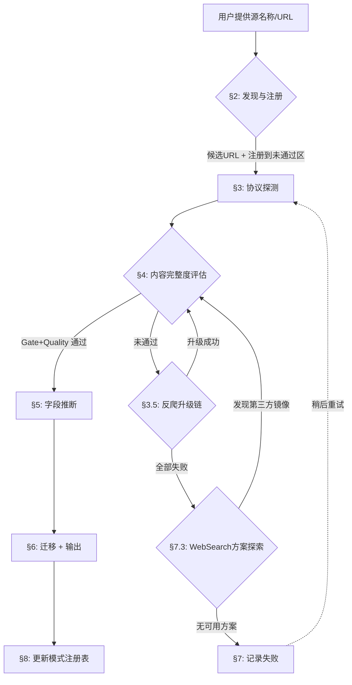

# Feed 数据源接入（Source Onboarding）

> 流程：分类基础 → 发现与注册 → 协议探测 → 完整度评估 → 字段推断 → 迁移输出 → 进化
> 进化机制：模式注册表 + 探测历史 + 自更新指令

## 快速参考流程图



**前置知识**（kind分类、子文档格式、标识字段、测试留档）见 [§1 分类体系与标识规范](#1-分类体系与标识规范)

## 适用场景

- 用户提供新数据源 URL，需要测试并接入
- 批量测试未通过区的源，尝试重新验证
- 已知源需要从「未通过」迁移到对应 type 区
- 需要为已通过源保存采集样本

---

## §1 分类体系与标识规范

以下规则同步自设计文档，修改请改主表。

### 1.1 kind 分类与 ID 编码

<!-- SYNC: kind_boundary REPLICA kind内容边界，主表见feedList_db.md §2.1 -->

| kind | kind_code | ID范围 | 判定关键 |
|------|-----------|--------|---------|
| `news` | 1 | 10001-19999 | **媒体机构**发布的编辑内容 |
| `filing` | 2 | 20001-29999 | **政府/监管/国际组织/评级机构**的官方发布 |
| `calendar` | 3 | 30001-39999 | 仅**日期**信息，不含数据内容 |
| `social` | 4 | 40001-49999 | **UGC平台**上的用户发布内容 |
| `metric` | 5 | 50001-59999 | 输出为 **(subject, metric_type, date, value)** 的数值型数据 |

**判定顺序**：政府/国际组织/监管/评级机构 → 一律 `filing`；UGC 平台 → `social`；数值型时序数据 → `metric`；仅日期事件 → `calendar`；剩余专业媒体 → `news`

**ID编码**：`feedList_id = kind_code × 10000 + seq`

### 1.2 标识字段规范

<!-- SYNC: feedList_field REPLICA 字段定义，主表见feedList_db.md §3 -->

| 字段 | 格式约束 |
|------|---------|
| `feedList_id` | INT, PK, UNIQUE 跨 kind |
| `name` | `^[a-z_]+$`, UNIQUE 跨 kind |
| `prefix` | `^[A-Z]{4}$`, UNIQUE 跨 kind |
| `status` | pending / designing / designed / developing / deployed |

### 1.3 子文档表格规范

<!-- SYNC: feedList_subdoc_format REPLICA 子文档规范，主表见feedList_db.md §4 -->

**表头规则**：🔒恒定列（feedList_id/name/prefix）+ 🧑人工列（name_cn/priority/status）+ type专属列 + note

| type分节 | type专属列 |
|----------|-----------|
| WEB | url + login_url + crawl_content_selector |
| RSS | url |
| API | api_provider |
| 未通过 | 无 status/type 列，仅 note |
| 废弃 | 无 priority/status/note 列，仅 废弃原因 |
| metric 额外 | 所有分节均加 metric_type 列 |

**格式规则**：
- 排序：priority DESC，同 priority 按 feedList_id ASC
- URL格式：`[字段名](url)` 超链接
- 登录凭证：`[login_url](url "name / password")` 嵌入 title
- crawl_content_selector：CSS选择器用反引号，`-` 表示 readability
- note 列：非表格列的管道参数简述，分号分隔

### 1.4 测试与留档规范

<!-- SYNC: feedList_subdoc_format REPLICA 测试规范，主表见feedList_db.md §4.3 -->

- 未通过测试验证的数据源不分配 type，归入「未通过」
- news/social 须获取正文（仅标题/摘要不算），filing/calendar/metric 须获取结构化数据
- 一端点一行：同一 provider 的不同端点必须拆为独立行
- 分配 type 后须在 `sources/{kind}/` 下保留样本
- 样本命名：`{feedList_id}_{name}_{type}_{YYYYMMDD}.{ext}`
- 样本格式化：JSON 用 `json.dump(indent=4)`、XML/RSS 用 `xmllint --format`、HTML 用 prettier
- feedList_id/name/prefix 在全部 5 个 kind 子文档中不重复（含废弃区，废弃标识永不复用）

### 1.5 废弃区规范

<!-- SYNC: feedList_subdoc_format REPLICA 废弃区规范，主表见feedList_db.md §4.4 -->

**位置**：「未通过」之后、「统计」之前

**列格式**：

标准 kind：
```
| feedList_id | name | prefix | name_cn | 废弃原因 |
```

metric kind（多 metric_type 列）：
```
| feedList_id | name | prefix | metric_type | name_cn | 废弃原因 |
```

**排序**：feedList_id ASC（归档顺序）

**废弃条件**（满足任一）：源永久关闭 / 数据质量持续低劣 / 被其他源完全替代 / 法律合规风险

**操作流程**：从原分区删除该行 → 追加到废弃区 → 更新原分区和废弃区标题数量 → 更新统计表

**核心规则**：废弃源的 feedList_id / name / prefix **永不复用**

---

## §2 发现与注册

### 2.1 发现（名称 → URL 候选列表）

**输入**：数据源名称（如 "Reuters"、"Financial Times"、"TradingEconomics"）

**输出**：候选 URL 列表 + 推荐 type

#### 两层发现架构

| 层 | 执行者 | 能力 | 适用场景 |
|----|--------|------|---------|
| **第 1 层** | Claude（WebSearch + WebFetch） | 语义搜索、跨域关联 | 名称模糊、需推理 |
| **第 2 层** | probe_source.py `--mode discover` | HTML link 解析、路径探测、CMS 识别 | 已知域名、批量验证 |

#### 第 1 层：Claude 智能发现

当用户仅提供源名称时，按以下步骤发现候选 URL：

1. **WebSearch 搜索**（并行发起 2-3 个搜索）：
   - `"{source_name}" RSS feed`
   - `"{source_name}" news API`
   - `site:{domain} rss OR feed OR atom`

2. **WebFetch 主域名**：抓取官网首页，提取：
   - `<link rel="alternate">` 标签中的 RSS/Atom URL
   - 页面中的 API 文档链接
   - CMS/框架标识（WordPress → /feed、Arc XP → /arcio/rss/）

3. **查阅模式注册表**：检查 `references/source_patterns.json`
   - `domain_shortcuts`：已知源的直接 URL 映射
   - `api_providers`：已知 API 供应商的端点模板
   - `cms_rss_paths`：CMS 平台 → RSS 路径映射

4. **编译候选列表**：合并所有发现的 URL，标注来源和置信度

#### 第 2 层：脚本批量发现

```bash
python3 probe_source.py --mode discover --url "https://example.com" --name "example" --kind news --output /tmp/discover.json
```

脚本自动执行 8 步：抓取主页→检测CMS→解析HTML link标签→CMS路径探测→扩展路径探测（从 `source_patterns.json` 加载）→已知源匹配→sitemap分析→验证所有候选

#### 发现 → 注册衔接

发现完成后，将候选列表呈现给用户确认后进入注册。

### 2.2 注册（加入未通过区）

#### 步骤

1. **确定 kind**：按 [§1.1 kind 分类](#11-kind-分类与-id-编码) 判定顺序分类
2. **分配 feedList_id**：读取目标 kind 文档（`docs/Feed/storage/feedList/{kind}.md`），扫描全文所有已用 ID，在该 kind 的 ID 范围内（如 news: 10001-19999）找到最小未使用 ID
3. **生成标识**：
   - `name`：全小写英文，无空格（可用下划线）
   - `prefix`：4位大写字母缩写
   - `name_cn`：中文名称
4. **确定 priority**：
   - 15: 核心级（Bloomberg/Reuters/SEC）
   - 12-14: 主流高优（BBC/WSJ/央行）
   - 9-11: 区域/垂直重要
   - 5-8: 补充性
   - 1-4: 小众/实验性
5. **写入未通过区**：按 priority DESC、feedList_id ASC 排序插入 `### 未通过` 表格，note 留空
6. **更新统计**：更新标题中的数量

#### 未通过区列格式

标准 kind：
```
| feedList_id | name | prefix | name_cn | priority | note |
```

metric kind（多 metric_type 列）：
```
| feedList_id | name | prefix | metric_type | name_cn | priority | note |
```

### 2.3 第三方镜像/桥接发现

**触发条件**：源自身域名的 RSS/API/WEB 全部探测失败（反爬封锁、需认证、SPA 无 SSR）。

**核心原则**：只接入能获取**最新数据**的镜像，历史归档不作为数据源（可作参考）。

#### 发现步骤

1. **WebSearch 搜索**（并行 2-3 个）：
   - `"{source_name}" RSS feed free`
   - `"{source_name}" scraping API alternative {current_year}`
   - `"{source_name}" mirror proxy open source`

2. **检查已知镜像服务**（查阅 `source_patterns.json → third_party_mirrors`）：
   - RSS 桥接：trumpstruth.org、RSSHub 实例
   - ActivityPub 桥接：bird.makeup
   - Embed/Syndication 端点：syndication.twitter.com
   - GitHub 归档（仅验证数据格式，不作为实时源）

3. **验证镜像可用性**：
   - HTTP 200 + 返回最新数据（**最新条目 ≤ 7 天**，否则不通过）
   - 包含正文内容（非仅标题/链接）
   - 无需认证

4. **评估稳定性**：
   - 官方服务（如 syndication.twitter.com）> 社区维护项目 > 个人项目
   - note 中标注 `第三方RSS镜像({domain})` 或 `Syndication端点`

#### 第三方源的 URL 记录

迁移时 URL 列填写**实际采集的第三方 URL**（非源官网），note 中标注第三方来源。

---

## §3 协议探测

### 3.1 探测与选型原则

**核心规则**：正文完整度决定是否通过，通过后按 **API > RSS > WEB** 选型。

```
探测顺序: RSS → API → WEB（并行或顺序均可）
选型优先: 正文完整的 API > 正文完整的 RSS > 正文完整的 WEB
淘汰规则: 所有协议都无法获取正文完整 → 未通过
CLI参数:  --kind {news|filing|calendar|social|metric} 控制判定标准
反爬回退: requests 遇 JS challenge(DataDome/Cloudflare/PerimeterX)
          → Playwright headless 重试 → 成功则 crawl_method=playwright
          → 仍失败则记录失败原因
```

### 3.2 执行命令

```bash
# 单协议探测
python3 probe_source.py --mode rss --url "{URL}" --output /tmp/probe_rss.json
python3 probe_source.py --mode api --url "{URL}" --headers '{"Authorization": "Bearer xxx"}' --output /tmp/probe_api.json
python3 probe_source.py --mode web --url "{URL}" --selector ".article-body" --output /tmp/probe_web.json

# 全自动发现（--kind 控制正文完整度标准，默认 news）
python3 probe_source.py --mode discover --url "{URL}" --kind filing --output /tmp/discover.json

# Playwright 回退（requests 遇反爬 JS challenge 时）
python3 probe_source.py --mode web --url "{URL}" --method playwright --output /tmp/probe_web_pw.json
```

### 3.3 可达性标准（HTTP 层）

| 模式 | 可达条件 | 失败特征 |
|------|---------|---------|
| RSS | HTTP 200 + 有效XML + ≥1 item + 含 title+link | 非XML / 无item / 仅title |
| API | HTTP 200 + 有效JSON + 非空数据数组 + 含正文或≥3字段 | 非JSON / 空数组 / 结构不可识别 |
| WEB(requests) | HTTP 200 + ≥200字正文 + 无硬paywall | **JS challenge → 触发 Playwright 回退** |
| WEB(playwright) | 页面加载完成 + ≥200字正文 + 无硬paywall | CAPTCHA需人工 / IP封锁 / 硬paywall |

**注意**：可达 ≠ 通过。可达但正文不完整的源标记为 `partial_content`，不分配 type。完整度标准因 kind 而异（见 [§4](#4-内容完整度评估)）。

> **Playwright 触发条件**：仅当 requests 返回 DataDome/Cloudflare/PerimeterX 等 JS challenge 时自动回退，不用于所有 WEB 探测（避免不必要的浏览器开销）。

### 3.4 探测结果记录格式

```
成功："{type}可达；{内容描述}；{完整性等级}"
失败："{失败类型}（{具体原因}）"
Playwright成功："{type}可达（playwright）；{内容描述}；{完整性等级}"
Playwright失败："{失败类型}（playwright亦无法绕过：{原因}）"
```

### 3.5 反爬绕过升级链

**触发条件**：§3.1-3.3 标准探测失败（403/JS challenge/SPA 空壳/需认证）。

**核心原则**：按成本从低到高逐级升级，每级成功即停止；只追求**最新数据**的可达性。

#### 升级层级

| 层级 | 方法 | 成本 | 适用场景 | 示例 |
|------|------|------|---------|------|
| L0 | 官方公开 API | 零 | API 免费且无需认证 | HackerNews Firebase API |
| L1 | RSS/Atom 订阅 | 零 | 源自带 RSS 或 CMS 默认路径 | WordPress `/feed`、Arc XP `/arcio/rss/` |
| L2 | Embed/Syndication 端点 | 零 | 平台提供嵌入式内容端点 | `syndication.twitter.com`、YouTube oEmbed |
| L3 | 第三方 RSS 桥接 | 低 | 社区维护的 RSS 镜像服务 | RSSHub、trumpstruth.org |
| L4 | Playwright headless | 中 | 需 JS 渲染但无高级反爬 | SPA 站点、轻度 Cloudflare |
| L5 | Playwright + 代理 | 高 | L3-L4 级反爬（Cloudflare/Akamai） | 地区封锁、IP 限速 |
| L6 | 住宅代理 + 指纹伪装 | 极高 | L4 级反爬（DataDome/PerimeterX） | 几乎无法绕过，优先放弃 |

#### 执行流程

```
标准探测失败 → 分析失败原因
├── 403/JS challenge
│   ├── 检查是否有 RSS 替代（L1）
│   ├── 检查是否有 Embed/Syndication 端点（L2）
│   ├── WebSearch 查找第三方 RSS 桥接（L3）→ [§2.3]
│   ├── Playwright 重试（L4）
│   └── Playwright + 代理（L5）
├── SPA 空壳（无 SSR）
│   ├── 检查 __NEXT_DATA__ / JSON-LD（仍走 requests）
│   ├── 检查是否有 API 端点（L0）
│   └── Playwright 渲染（L4）
├── 需认证（401/OAuth）
│   ├── 检查是否有免费 tier
│   ├── 检查是否有 RSS 替代（L1）
│   └── 记录认证需求，标记未通过
└── 硬 Paywall
    ├── 检查 RSS 是否泄露全文（L1）
    └── 标记未通过
```

#### 升级决策规则

- **L6 不推荐**：DataDome/PerimeterX 绕过率极低，维护成本高于数据价值
- **同层级多方案时**：稳定性优先（官方端点 > 社区项目 > 个人项目）
- **升级前必查**：`source_patterns.json → anti_crawl_solutions` 中是否有已知方案
- **升级成功后**：note 中记录实际使用的层级方法（如 `Syndication端点`、`第三方RSS镜像`、`playwright`）

### 3.6 Subscription 源多目标质量测试

**触发条件**：`scope=subscription` 的源（按实体/账号订阅，如 Twitter per screen_name、SEC per CIK）。

**核心问题**：同一 API/端点对不同订阅目标可能返回不同质量的数据。

#### 测试矩阵

选取 **≥3 个代表性目标**，覆盖不同活跃度层级：

| 活跃度 | 选取标准 | 示例（Twitter） | 示例（SEC） |
|--------|---------|----------------|-------------|
| 高 | 日均发布 >20 条 | @Reuters, @DeItaone | AAPL (CIK 320193) |
| 中 | 日均发布 3-20 条 | @CNBC, @WSJ | TSLA (CIK 1318605) |
| 低 | 日均发布 <3 条 | @federalreserve, @SECGov | 小型公司 |

#### 质量分类

测试后按返回数据质量将目标分为三档：

| 档位 | 条件 | 行动 |
|------|------|------|
| **T1 优质** | 返回最新时序数据 + 正文完整 | 推荐订阅目标 |
| **T2 可用** | 返回数据但排序异常（如热门而非最新） | 可用但需注意排序 |
| **T3 不可用** | 返回空数据 / 需额外认证 / 被限流 | 该目标不可订阅 |

#### note 记录格式

测试结果写入 note 列：

```
scope=subscription(per {target_type})；{T1数量}个优质/{T2数量}个可用/{T3数量}个不可用
```

示例：`scope=subscription(per screen_name)；部分高量账号返回热门而非最新`

#### 与 §4 评估的关系

- Subscription 源的 Gate/Quality 评估**以 T1 档目标的响应为准**
- note 中记录质量差异，供下游调度器选择最佳目标

---

## §4 内容完整度评估

### 4.1 Gate + Quality 双层架构

**正文完整度判定**由 `evaluate_content_completeness(result, kind)` 函数执行，返回：

```python
{
    "complete": bool,        # gates_passed AND score >= threshold
    "score": float,          # 0.0-1.0 quality score（仅 gate 全过时计算）
    "threshold": float,
    "gates_passed": bool,    # ALL gates True
    "gates": {               # 每个 gate 的通过状态
        "has_title": True,
        "has_content_source": True,
        ...
    },
    "signals": {             # 每个 quality signal 的得分
        "body_richness": 0.8,
        "structural_depth": 0.6,
        ...
    },
    "grade": "A",            # 从 score 派生
}
```

**双层原理**：

- **Gate（门槛层）**：下游 NOT NULL 字段的探针端映射。任一 gate 未通过 → `complete=False`，不计算质量评分。
- **Quality（质量层）**：仅 gate 全过时执行，`score = Σ(weight × signal_score) / Σ(weight)`，`score ≥ threshold` → `complete=True`。

**为什么分两层**：Gate 解决"能不能用"（has_title 权重 0.5 意味着标题可被字数补偿，但下游 feedAnalyzer NER 在无标题时必定降级）；Quality 解决"好不好用"。

**执行流程**：

```
输入 → Gate 层（ALL must pass）
  ├── 任一 gate 失败 → complete=False, grade=D, 不计算 quality
  └── 全部通过 → Quality 层（加权评分）
        score = Σ(weight × signal_score) / Σ(weight)
        score ≥ threshold → complete=True
        grade = _derive_grade(score)
```

### 4.2 Gate 定义

Gate 来源：feedLive_db NOT NULL 字段 + feedAnalyzer/feedScorer 的硬依赖。

#### Gate 类型

| gate_type | 语义 | 示例 |
|-----------|------|------|
| `bool` | `details[key]` 为真 | `has_title` |
| `or` | `details` 中任一 key 为真 | `has_content_tag OR has_description` |
| `gt` | `details[key] > min` | `char_count > 50` |
| `field_group_hit` | 指定字段组至少命中一个 | filing.id 组 |
| `freshness` | `days_since_update ≤ max_days` | `latest_pub_age ≤ 90` |

**新鲜度计算**：`days_since_update = now - max(channel.lastBuildDate, latest_item.pubDate)`；两者均无 → `∞` → gate 失败。

#### 完整 Gate 定义表（kind × mode）

| kind | mode | gates |
|------|------|-------|
| news | rss | has_title(bool) + has_content_source(or: has_content_tag, has_description) + has_link(bool) + is_fresh(freshness: ≤90d) |
| news | api | has_content_source(bool: has_content_field) |
| news | web | has_title(bool) + has_content_source(gt: char_count>50) |
| filing | rss | has_title(bool) + has_identifier(bool: has_link) + is_fresh(freshness: ≤90d) |
| filing | api | has_identifier(field_group_hit: filing.id) |
| filing | web | has_title(bool) |
| calendar | rss | has_date(bool: has_pubdate) + has_event(bool: has_title) + is_fresh(freshness: ≤90d) |
| calendar | api | has_date(bool: has_date_field) + has_event(field_group_hit: calendar.event) |
| calendar | web | has_date(bool: has_time) |
| social | rss | has_content(bool: has_description) + is_fresh(freshness: ≤90d) |
| social | api | has_content(bool: has_content_field) |
| social | web | has_content(gt: char_count>5) |
| metric | api | has_numeric(bool: has_numeric_field) + has_date(bool: has_date_field) |

**说明**：metric 仅走 API（RSS/WEB 无配置 → 评估返回 empty → complete=False）。RSS 的 is_fresh gate 拦截已停更的 feed（如 WSJ RSS 停更于 2025-01，380天 > 90天阈值 → gate 失败）。

### 4.3 Quality 信号与权重

Gate 过滤后，Quality 信号衡量"好不好用"。

#### 权重原理

**权重 = 下游影响权重 × 信号区分度**：

| 权重 | 含义 | 对应下游 |
|------|------|---------|
| 3.0 | NLP/LLM 直接依赖 | feedAnalyzer NER、EventDriven LLM 提取 |
| 2.0 | 内容可用性判定 | 内容截断/付费墙/一致性 |
| 1.0 | 辅助质量信号 | 元数据完备度（时间/作者） |

**阈值原理**：Gate 已过滤掉不可用的源，Quality 只需区分"够用"和"优秀"，因此阈值较低（0.20-0.45）。

#### 信号分类

**内容丰富度**：

| 信号 | 适用 mode | 权重 | 说明 |
|------|----------|------|------|
| `body_richness` | RSS/API/WEB | 0.5-3.0 | 正文字符数分段线性映射 |
| `structural_depth` | RSS/WEB | 2.0 | 段落数阶梯评分 |
| `field_coverage` | API | 3.0 | API 字段组覆盖率 |

**内容可信度**：

| 信号 | 适用 mode | 权重 | 说明 |
|------|----------|------|------|
| `no_truncation` | RSS/WEB | 1.0-2.0 | 无截断标记 |
| `no_paywall` | WEB | 2.0 | 无付费墙 |
| `content_signal_ratio` | WEB | 1.0 | 正文/页面比例 |
| `item_consistency` | RSS | 1.0 | 条目长度变异系数低 |
| `data_freshness` | RSS | 2.0 | 最新条目距今天数（≤1d→1.0；1-7d→0.8；7-30d→0.5；30-90d→0.2） |

**元数据完备度**：

| 信号 | 适用 mode | 权重 | 说明 |
|------|----------|------|------|
| `has_time` | WEB | 1.0 | 有时间标记 |
| `has_author` | WEB | 1.0 | 有作者信息 |
| `field_quality` | API | 1.0-2.0 | 空字段比例低 |
| `item_count` | RSS/API(social) | 0.5 | 条目数量充足 |

#### 完整信号配置（kind × mode × threshold）

| kind | mode | threshold | 核心信号（权重排序） |
|------|------|-----------|-------------------|
| news | rss | 0.45 | body_richness(3.0), data_freshness(2.0), structural_depth(2.0), no_truncation(2.0), item_consistency(1.0) |
| news | api | 0.40 | body_richness(3.0), field_quality(1.0) |
| news | web | 0.45 | body_richness(3.0), structural_depth(2.0), no_truncation(2.0), no_paywall(2.0), content_signal_ratio(1.0), has_time(1.0), has_author(1.0) |
| filing | rss | 0.30 | body_richness(2.0), data_freshness(2.0), no_truncation(1.0) |
| filing | api | 0.45 | field_coverage(3.0), field_quality(2.0), has_date(1.0) |
| filing | web | 0.35 | body_richness(3.0), has_structured(1.5), no_truncation(1.0) |
| calendar | rss | 0.20 | data_freshness(2.0), body_richness(0.5) |
| calendar | api | 0.40 | field_coverage(3.0), field_quality(1.0) |
| calendar | web | 0.30 | body_richness(1.5), has_title(1.0) |
| social | rss | 0.30 | body_richness(2.0), data_freshness(2.0), item_count(0.5) |
| social | api | 0.30 | body_richness(2.0), field_quality(1.0), item_count(0.5) |
| social | web | 0.25 | body_richness(2.0) |
| metric | api | 0.40 | field_coverage(3.0), field_quality(1.0) |

### 4.4 评分函数库

| scorer 类型 | 公式 |
|------------|------|
| `length` | 分段线性：`<low→0.0`, `low→mid: 0.6×(v-low)/(mid-low)`, `mid→high: 0.6+0.4×(v-mid)/(high-mid)`, `≥high→1.0` |
| `bool` / `bool_inverse` | `True→1.0, False→0.0` / `False→1.0, True→0.0` |
| `ratio_inverse` | `≤good→1.0, ≥bad→0.0`, 线性插值 |
| `paragraph_depth` | RSS: 1→0.3, 3→0.7, 5→1.0；WEB: 3→0.3, 5→0.6, 10→1.0 |
| `field_group_coverage` | `matched_groups / total_groups`（用 KIND_FIELD_PATTERNS） |
| `item_count_ratio` | `min(item_count / 5, 1.0)` |
| `freshness` | 分段阶梯：`≤1d→1.0, 1-7d→0.8, 7-30d→0.5, 30-90d→0.2, >90d→0.0` |

### 4.5 评级派生

评级由 quality score 自动派生（`_derive_grade`），取代独立的 `grade_completeness` 函数：

| 等级 | quality score | 含义 |
|------|-------------|------|
| A | ≥ 0.85 | 下游全链路高质量可用 |
| B | ≥ 0.55 | 下游可用，部分信号缺失 |
| C | ≥ 0.25 | 勉强可用，建议补充 |
| D | < 0.25 | 不可用（或 gate 未通过） |

### 4.6 选型决策矩阵

| 场景 | 行动 |
|------|------|
| API正文完整 + RSS正文完整 + WEB正文完整 | 选 API（最优先） |
| API不完整 + RSS正文完整 + WEB正文完整 | 选 RSS |
| API不完整 + RSS不完整 + WEB正文完整 | 选 WEB |
| 全部可达但正文均不完整 | **未通过**，note 记录 `partial_content` |
| 多个同类型都正文完整 | 优先 grade 最高；同级优先 html_link 来源 > path_probe |
| 全部以瞬态错误失败(429/503) | 延迟30秒重试一次，仍失败则记录 |

---

## §5 字段推断

探测通过后，脚本自动推断以下隐藏字段值，确保与 feedSourceAdapter 爬虫体系匹配。

<!-- SYNC: feedList_field REPLICA 字段推断规则，主表见feedList_db.md §3 -->

### 5.1 D 组：爬取字段（type=WEB/RSS）

| 字段 | 推断规则 |
|------|---------|
| `crawl_method` | requests（SSR 可达）/ playwright（需 JS 渲染或 L3-L4 反爬）/ scrapy（仅 crawl_range=full 时） |
| `crawl_mode` | feed_only（type=RSS，RSS全文无需补全）/ feed_enrich（type=RSS，RSS摘要+跟随link抓正文）/ list_detail（WEB 默认，首页有文章链接）/ list_only（社交/指标，列表页即完整数据） |
| `crawl_content_selector` | 探测时验证有效的 CSS 选择器；NULL 则用 readability |
| `crawl_list_selector` | 列表页提取文章 URL 的选择器；NULL 则回退到 `a[href]` + URL 模式过滤 |
| `crawl_json_path` | Next.js → `__NEXT_DATA__` 路径；JSON-LD → `articleBody`；否则 NULL |
| `crawl_exclude_selector` | 常见噪声选择器（广告/相关文章/评论区） |
| `crawl_use_proxy` | 0（默认）/ 1（EU封锁/住宅代理/L3-L4反爬） |
| `crawl_range` | latest（默认实时采集）/ full（历史全量）/ incremental（增量续采） |
| `max_pages` | 从列表页分析得出合理值（默认 10） |

**crawl_method 决策树**：
```
requests 探测成功？
├── 是 → crawl_method = requests
│   ├── 含 __NEXT_DATA__ → 记录 crawl_json_path
│   ├── 含 JSON-LD articleBody → 记录 crawl_json_path
│   └── 纯 HTML → 记录 crawl_content_selector
└── 否 → 分析失败原因
    ├── Cloudflare/Akamai/DataDome → playwright + proxy
    ├── SPA/JS 渲染 → playwright
    └── 硬 403/paywall → 未通过
```

**crawl_mode 推断**：

| 条件 | crawl_mode |
|------|-----------|
| type=RSS + content:encoded含完整文章 | `feed_only` |
| type=RSS + 仅摘要，需Web补全正文 | `feed_enrich` |
| type=WEB + 有文章链接列表 | `list_detail` |
| type=WEB + 列表页内容已完整 | `list_only` |
| type=API | 不适用（走 G 组） |

### 5.2 E 组：登录字段（login_requires=1 时激活）

| 字段 | 推断规则 |
|------|---------|
| `login_requires` | 0（默认）/ 1（付费墙+有凭据 / OAuth2） |
| `login_method` | form / oauth2 / api_key / basic_auth |
| `login_url` | 登录页面 URL（form 时必填） |
| `login_name` / `login_password` | 用户提供（不主动猜测） |
| `oauth_token_url` / `oauth_client_id` | OAuth2 时必填 |

### 5.3 F 组：Cookie 字段（type=WEB 或 login_requires=1）

| 字段 | 推断规则 |
|------|---------|
| `cookie_user_agent` | NULL / 特定 UA（如 SEC 要求声明身份） |
| `cookie_headers` | NULL / JSON 对象（如 CLS 需要 Referer+UA） |
| `cookie_refresh_method` | manual（默认）/ auto_login / browser |
| `cookie_refresh_interval` | 86400（默认 1 天） |

### 5.4 G 组：API 字段（type=API）

| 字段 | 推断规则 |
|------|---------|
| `api_provider` | 从 URL 域名推断供应商名 |
| `api_key_ref` | Secret 引用名（非明文），格式 `{provider}_api_key` |
| `api_auth_method` | none / api_key / bearer / oauth2 / basic |
| `pagination_type` | 从探测响应推断（见下表） |

**api_auth_method 推断**：

| 探测发现 | api_auth_method |
|---------|----------------|
| 无参数直接 200 | `none` |
| URL含 ?apikey= 或需 key | `api_key` |
| 401 + Bearer scheme | `bearer` |
| 401 + Basic realm | `basic` |
| 已知需 OAuth2 | `oauth2` |

**pagination_type 推断**：

| 探测发现 | pagination_type |
|---------|----------------|
| 响应含 `next_url` / `next` 链接 | `cursor` |
| 响应含 `nextPageToken` / `page_token` | `token` |
| URL 含 `?offset=` / `?start=` | `offset` |
| URL 含 `?page=` / `?p=` | `page` |
| 单次返回全部数据（无分页字段） | `none` |
| 无法判断 | `NULL` |

### 5.5 C 组：调度字段

| 字段 | 推断规则 |
|------|---------|
| `scope` | broadcast（默认）/ subscription（按实体订阅，如 SEC per-CIK） |
| `trigger` | scheduled（绝大多数源） |
| `poll_interval_sec` | 按 priority：15→60s, 12-14→300s, 9-11→900s, 5-8→3600s, 1-4→86400s |

### 5.6 B 组：去重字段

| 字段 | 推断规则 |
|------|---------|
| `dedup_key_hint` | 从探测响应的数据结构推断（见下表） |

**dedup_key_hint 推断**：

| 探测发现 | dedup_key_hint |
|---------|----------------|
| RSS 含 `entry.link` | `url` |
| API 响应含 `id` 字段（整数/字符串唯一ID） | `id` |
| SEC EDGAR 端点 | `accession_number` |
| 社交平台含 `post_id` / `tweet_id` | `post_id` |
| 日历 API 含 symbol+date 但无唯一 ID | `symbol+date+type` |
| metric API 含 entity+date 但无唯一 ID | `entity+date+metric` |
| WEB 源 | `url`（默认） |
| 无法判断 | `NULL`（用 kind 默认策略） |

---

## §6 迁移与输出

### 6.1 选择最佳 type

多协议正文完整时优先级：**API > RSS > WEB**（正文完整度优先，同等完整度下按此序）

### 6.2 迁移表格行

1. **从未通过区删除该行**
2. **在对应 type 区追加该行**（按 priority DESC 插入正确位置）
3. **设置 `status` 为 `designed`**

#### type=WEB 行格式
```markdown
| {id} | {name} | {prefix} | {name_cn} | {priority} | designed | [url]({actual_url}) | {login_url或-} | `{selector}` | {note} |
```

- `login_url`：无登录需求填 `-`；有凭据用 `[login_url](url "user / pass")` 格式
- `crawl_content_selector`：探测验证有效的选择器用反引号；无则填 `-`（readability）
- `note` **必须包含**：渲染技术 + 内容描述 + crawl_json_path（如有）+ 列表页信息 + 反爬/paywall状况

#### type=RSS 行格式
```markdown
| {id} | {name} | {prefix} | {name_cn} | {priority} | designed | [url]({rss_feed_url}) | {note} |
```

- `note` **必须包含**：RSS格式变体 + 内容完整度 + 二次Web抓取可行性 + 语言

#### type=API 行格式
```markdown
| {id} | {name} | {prefix} | {name_cn} | {priority} | designed | {provider} | {note} |
```

- `note` **必须包含**：api_auth_method + 响应格式 + 关键字段 + 分页机制

note 列的短语编码规范见 [§6.3 note 编码词典](#63-note-编码词典)。

### 6.3 note 编码词典

note 列承载所有**非表格列**的管道参数。编码顺序：渲染技术 → 内容描述 → 特殊字段 → 反爬/代理/认证。

| note 短语 | 映射的隐藏字段 |
|----------|--------------|
| `SSR` / `SSR HTML可提取` | crawl_method=requests |
| `requests可达` | crawl_method=requests（显式确认） |
| `Next.js SSR` | crawl_method=requests + crawl_json_path=__NEXT_DATA__.xxx |
| `JSON-LD articleBody` | crawl_json_path=articleBody |
| `crawl_json_path=xxx` | 显式声明 crawl_json_path 值 |
| `content:encoded含完整文章` | crawl_mode=feed_only, RSS 全文 |
| `纯RSS即可` | crawl_mode=feed_only |
| `摘要~N字；Web全文SSR` | crawl_mode=feed_enrich |
| `首页N篇文章链接` | crawl_mode=list_detail |
| `N条/页；?before=分页` | 分页机制=cursor |
| `Drupal` / `WordPress` / `Webflow` | CMS 平台 |
| `无封锁` / `无paywall` | login_requires=0, crawl_use_proxy=0 |
| `Cloudflare` / `DataDome` | crawl_method=playwright |
| `EU地区封锁` / `需住宅代理` | crawl_use_proxy=1 |
| `无需认证` / `公开可达` | api_auth_method=none |
| `免费key可达` | api_auth_method=api_key |
| `需UA+Referer` | cookie_headers 需配置 |
| `仅需User-Agent` | cookie_user_agent 需配置 |
| `scope=subscription` | scope=subscription |
| `scope=subscription(per {target})` | scope=subscription + 订阅目标类型 |
| `Atom格式` / `RDF格式` | RSS 解析器变体 |
| `第三方RSS镜像({domain})` | §2.3 第三方桥接源，URL 列填实际采集地址 |
| `Syndication端点` | §3.5 L2 级，平台官方嵌入式内容端点 |
| `N条/请求含{fields}` | 单次请求返回的条目数和关键字段 |
| `部分高量账号返回热门而非最新` | §3.6 subscription 质量差异记录 |

### 6.4 完整字段配置输出

迁移后，以 YAML 注释块形式输出该源的完整爬虫配置，供后续开发使用：

```yaml
# === feedList_db 完整配置 ===
# feedList_id: {id}
# name: {name}
# kind: {kind}
# type: {WEB|RSS|API}
# status: designed
#
# --- D组: 爬取 (type=WEB/RSS) ---
# crawl_method: requests|playwright
# crawl_mode: list_detail|list_only|feed_only|feed_enrich
# crawl_content_selector: "{selector}" | NULL
# crawl_list_selector: "{selector}" | NULL
# crawl_json_path: "{path}" | NULL
# crawl_exclude_selector: ["{sel1}", "{sel2}"] | NULL
# crawl_use_proxy: 0|1
# crawl_range: latest
# max_pages: 10
#
# --- E组: 登录 (login_requires=1时) ---
# login_requires: 0|1
# login_method: form|oauth2|api_key|basic_auth
# login_url: "{url}" | NULL
# oauth_token_url: "{url}" | NULL
# oauth_client_id: "{id}" | NULL
#
# --- F组: Cookie (type=WEB或login_requires=1) ---
# cookie_user_agent: NULL | "{ua}"
# cookie_headers: NULL | {"Referer": "...", ...}
# cookie_refresh_method: manual|auto_login|browser
#
# --- G组: API (type=API) ---
# api_provider: "{provider}"
# api_key_ref: "{secret_name}" | NULL
# api_auth_method: none|api_key|bearer|oauth2|basic
#
# --- C组: 调度 ---
# scope: broadcast|subscription
# trigger: scheduled
# poll_interval_sec: {seconds}
```

**只输出与该源相关的字段组**（按 feedList_db §3.1 适配矩阵）：
- type=RSS → D + C（E/F 仅当 login_requires=1）
- type=WEB → D + F + C（E 仅当 login_requires=1）
- type=API → G + C（D 不适用；E/F 仅当 login_requires=1）

### 6.5 保存采集样本

```bash
cp /tmp/probe_{type}.{ext} docs/Feed/sources/{kind}/{feedList_id}_{name}_{type}_{YYYYMMDD}.{ext}
```

样本格式化：JSON → `json.dump(indent=4)`、XML/RSS → `xmllint --format`、HTML → prettier

大小限制：API/RSS <1MB，WEB <500KB；超限则截取。

### 6.6 更新统计

更新 type 区和未通过区标题中的数量。

---

## §7 失败处理与批量操作

### 7.1 失败原因记录

在未通过区 note 列填写失败原因：

| 失败类型 | note 格式示例 |
|---------|-------------|
| 反爬拦截 | `Cloudflare 403` |
| 高级反爬 | `DataDome CAPTCHA；需住宅代理+Playwright` |
| 付费墙 | `硬Paywall "Subscribe to read"` |
| SPA 无 SSR | `SPA骨架屏无内容，需JS渲染` |
| 需认证 | `API需OAuth2 Bearer Token` |
| 端点失效 | `RSS返回404` |
| 内容不足 | `RSS仅title+link，无description` |

### 7.2 批量操作规范

多个源时使用 Task 工具并行探测（最多 3 个并发）。

**失败处理**：若批量中 >50% 失败，暂停检查共性原因（IP限速、网络问题）再继续。

汇总报告格式：

```markdown
| # | name | RSS | API | WEB | 推荐type | 完整性 | 行动 |
|---|------|-----|-----|-----|---------|--------|------|
| 1 | xxx  | ✅A  | ❌   | ✅B  | RSS     | A      | 迁移 |
| 2 | yyy  | ❌   | ❌   | ❌   | -       | D      | 记录 |
```

用户确认后批量执行迁移。

### 7.3 WebSearch 驱动的方案探索

**触发条件**：§3.5 反爬升级链全部失败，或标准探测返回的数据无法满足时效性要求。

**核心原则**：利用 WebSearch 的语义搜索能力发现非显而易见的替代方案（第三方镜像、社区项目、非官方 API）。

#### 搜索策略

并行发起 2-3 个搜索，覆盖不同发现路径：

| 搜索模板 | 发现目标 | 示例 |
|---------|---------|------|
| `"{source_name}" RSS feed free {year}` | 第三方 RSS 桥接 | 发现 trumpstruth.org |
| `"{source_name}" API alternative scraping {year}` | 替代 API/爬取方案 | 发现 syndication.twitter.com |
| `"{source_name}" open source data mirror` | 开源数据镜像 | GitHub 归档项目 |
| `site:github.com "{source_name}" RSS OR feed OR scraper` | 社区工具 | RSSHub 规则、爬虫项目 |

**关键**：搜索查询中包含 `{current_year}` 确保结果时效性。

#### 评估发现的方案

对每个搜索结果按以下标准评估：

| 评估维度 | 通过条件 | 淘汰条件 |
|---------|---------|---------|
| **时效性** | 最新数据 ≤ 7 天 | 仅历史归档 |
| **内容完整度** | 含正文/结构化数据 | 仅标题/链接 |
| **可达性** | HTTP 200 + 无需认证 | 需付费/OAuth |
| **稳定性** | 官方服务或活跃维护项目 | 个人项目/已停更 |

#### 方案发现后的处理

```
WebSearch 发现可用方案
├── 第三方 RSS → 回到 §3 RSS 探测 → §4 评估
├── 替代 API → 回到 §3 API 探测 → §4 评估
├── 替代 WEB 端点 → 回到 §3 WEB 探测 → §4 评估
└── 无可用方案 → §7.1 记录失败原因
```

发现的新模式同步更新到 `source_patterns.json`（见 [§8](#8-自更新进化)）。

---

## §8 自更新进化

每次成功接入新源后，更新知识库：

1. **探测历史**（自动）：`probe_source.py` 自动追加到 `references/probe_history.jsonl`
2. **模式注册表**（手动触发）：发现新模式时更新 `references/source_patterns.json`
   - 新 CMS RSS 路径 → `cms_rss_paths`（需 2+ 源验证）
   - 新 API 供应商 → `api_providers`
   - 新有效 RSS 路径 → `extended_rss_paths`
   - 新反爬绕过经验 → `anti_crawl_solutions`
   - 新已知源映射 → `domain_shortcuts`
3. **周期分析**：每接入约 10 个源，分析 `probe_history.jsonl` 的成功率趋势和常见失败模式

**更新规则**：只追加不删除，更新 `_meta.last_updated` 日期。

---

## §9 接入检查清单

每次接入完成后核验：

**标识唯一性**：
- [ ] feedList_id 在该 kind 范围内且跨 5 个 kind 唯一（含废弃区，废弃标识不可复用）
- [ ] name 全小写 `^[a-z_]+$`，prefix 4 位大写 `^[A-Z]{4}$`，跨 kind 唯一（含废弃区）

**表格迁移**：
- [ ] 通过源已从未通过区移除，已按 priority DESC 插入对应 type 区
- [ ] status 设为 `designed`
- [ ] 统计数量已更新（type 区标题 + 未通过区标题）

**字段配置完整性**：
- [ ] note 列包含所有隐藏字段的短语编码（参照 [§6.3 note 编码词典](#63-note-编码词典)）
- [ ] WEB 源：crawl_content_selector 已填写（或 `-` 表示 readability）
- [ ] WEB 源：login_url 已填写（或 `-` 表示无需登录）
- [ ] WEB 源含 JSON 内容：note 中记录了 crawl_json_path
- [ ] API 源：note 中记录了 api_auth_method
- [ ] RSS 源：note 中记录了内容完整度和二次 Web 可行性
- [ ] 已输出完整字段配置 YAML 块

**样本留档**：
- [ ] 样本已保存到 `docs/Feed/sources/{kind}/` 并格式化
- [ ] 样本命名符合 `{id}_{name}_{type}_{date}.{ext}`

---

## 文件路径速查

| 资源 | 路径 |
|------|------|
| kind 子文档 | `docs/Feed/storage/feedList/{kind}.md` |
| 样本目录 | `docs/Feed/sources/{kind}/` |
| feedList_db 主表 | `docs/Feed/storage/feedList_db.md` |
| sources 技术域 | `docs/Feed/sources.md` |
| 探测脚本 | `~/.claude/skills/feed-source-onboarding/scripts/probe_source.py` |
| 模式注册表 | `~/.claude/skills/feed-source-onboarding/references/source_patterns.json` |
| 探测历史 | `~/.claude/skills/feed-source-onboarding/references/probe_history.jsonl` |