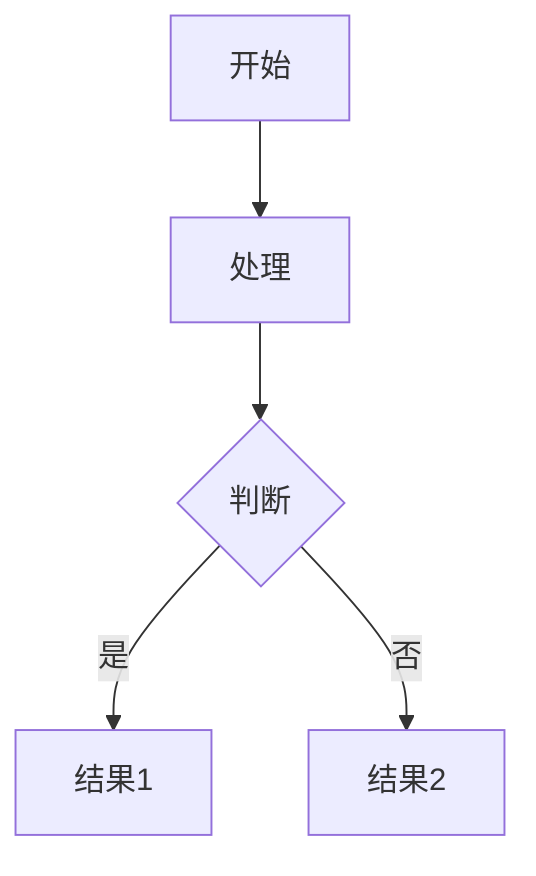
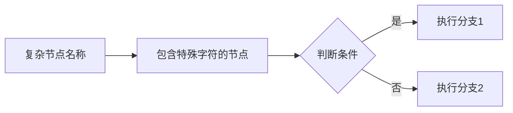
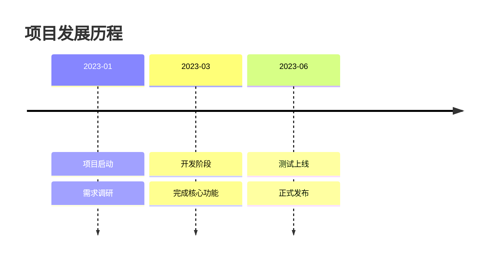
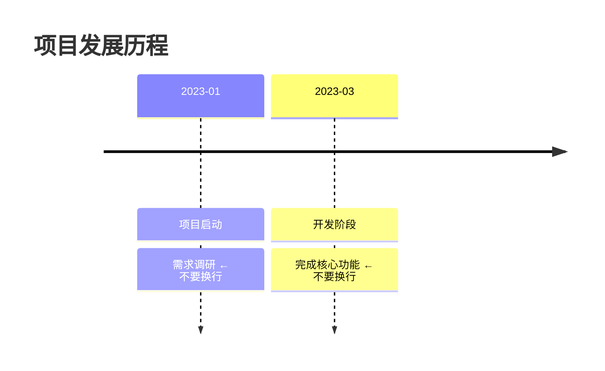
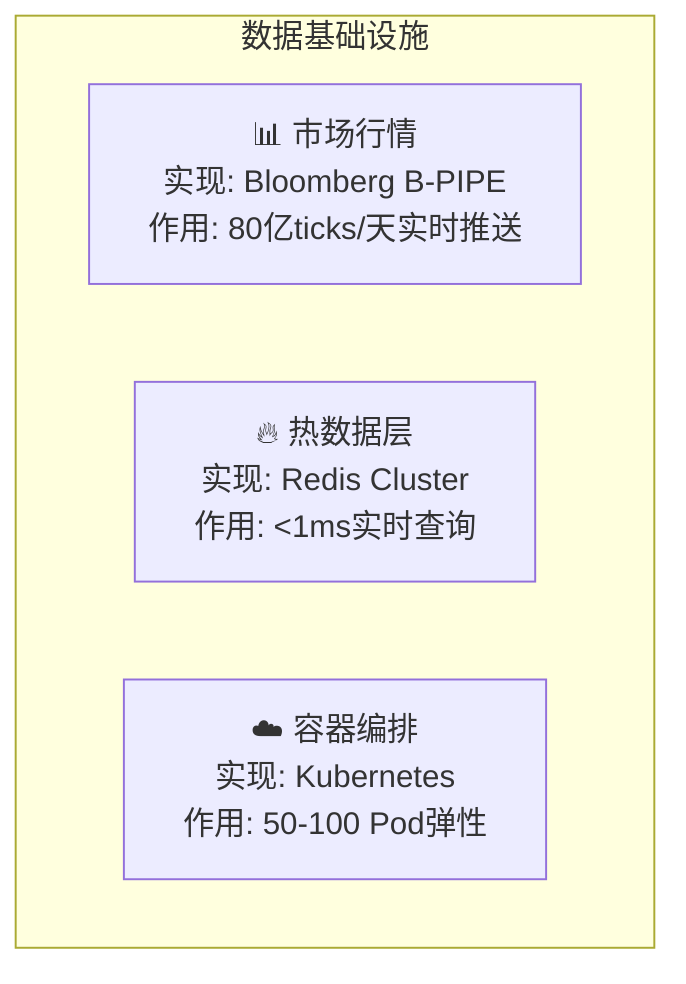

# Markdown 文档编写专家

## 何时使用

当需要编写、修改或优化 Markdown 文档时使用此技能，包括：
- 技术文档
- 项目 README
- API 文档
- 设计文档
- 教程和指南
- 会议记录

## 核心原则

### 1. 结构清晰
- 使用合理的标题层级（#, ##, ###）
- 每个文档只有一个 H1 标题
- **标题层级不跳跃**（不从 H2 直接到 H4）⚠️ Claude 易犯
- 使用目录（超过 600 行的文档）
- 标题前后必须有空行（文档开头除外）

### 2. 格式规范
- **代码块必须标注语言类型**（python/bash/json等）⚠️ Claude 易犯
- 表格对齐且格式统一（分隔符至少3字符：`---`）
- 列表缩进正确（统一使用 `-` 标记）
- 链接格式统一
- 列表和代码块前后必须有空行

### 3. 内容专业
- 术语准确一致
- 示例可执行
- 说明简洁明了
- 避免歧义

## 编写规范

### 标题规范

✅ **正确**：
```markdown
# 项目总览

## 快速开始

### 安装步骤

#### 环境要求
```

❌ **错误**：
```markdown
# 项目总览

### 快速开始  ← 跳过了 H2

## 安装步骤  ← 层级混乱
```

### 代码块规范

✅ **正确**：
````markdown
```python
def hello_world():
    print("Hello, World!")
```
````

````markdown
```bash
npm install
```
````

❌ **错误**：
````markdown
```
# 没有语言标注
code here
```
````

### 列表规范

✅ **正确**：
```markdown
- 父项目
  - 子项 1
  - 子项 2
    - 孙项 1

1. 第一步
2. 第二步
   - 详细说明
3. 第三步
```

❌ **错误**：
```markdown
- 父项目
- 子项 1  ← 缩进错误
  - 孙项 1  ← 层级混乱
```

### 表格规范

✅ **正确**：
```markdown
| 列名1 | 列名2 | 列名3 |
|-------|-------|-------|
| 数据1 | 数据2 | 数据3 |
| 数据4 | 数据5 | 数据6 |
```

**对齐方式**：
```markdown
| 左对齐 | 居中 | 右对齐 |
|:-------|:----:|-------:|
| 内容   | 内容 |   内容 |
```

### 链接规范

✅ **正确**：
```markdown
[文本链接](https://example.com)
[相对路径](./docs/guide.md)
[带标题的链接](https://example.com "悬停提示")
[锚点链接](#章节标题)
```

⚠️ **锚点链接特别注意**：

**标题中的emoji会导致锚点链接失效**

❌ 错误：
```markdown
## 📊 数据分析
[跳转](#📊-数据分析)  ← 无效
```

✅ 正确：
```markdown
## 数据分析
[跳转](#数据分析)  ← 有效
```

**原因**：GitHub/GitLab生成锚点时会完全移除emoji，导致 `#📊-数据分析` 无法匹配实际的 `#数据分析`

**最佳实践**：标题避免使用emoji，保持简洁专业

### Mermaid 图表规范

✅ **正确**：
````markdown

````

**注意事项**：
- ✅ 优先使用mermaid表示复杂逻辑，而不是ascii
- ❌ **严禁加入任何 `style` 属性**（不要加任何style样式，包括fill、stroke、color等）⚠️ Claude 易犯
- ✅ 图表不应过宽或过长，影响可读性
- ✅ 连线需标明语义 label
- ⚠️ **尺寸控制**：节点名称≤8汉字，横向≤5节点，纵向≤10层级

**特殊字符处理规范** ⚠️：

Mermaid对特殊字符敏感，使用不当会导致解析错误。以下是常见问题和解决方案：

| 问题字符 | 错误示例 | 正确示例 | 说明 |
|---------|---------|---------|------|
| **style属性** | `style A fill:#f9f` | *(不使用任何style)* | ❌ **严禁使用任何style样式属性** |
| **括号()** | `A[VAR(1-4)]` | `A["VAR lag:1-4"]` | 括号会被误解析，需用引号包围或改用其他符号 |
| **方括号[]** | `A[数组[0]]` | `A["数组索引0"]` | 嵌套方括号导致解析混乱 |
| **花括号{}** | `A[对象{key}]` | `A["对象.key"]` | 花括号与判断节点冲突 |
| **引号""** | `A[He said "yes"]` | `A['He said yes']` | 内部引号需转义或避免 |
| **尖括号<>** | `A[<html>标签]` | `A["HTML标签"]` | HTML标签被误解析 |
| **管道符\|** | `A[A\|B选择]` | `A["A或B选择"]` | 管道符用于连线标注 |

**最佳实践**：
````markdown
✅ **推荐写法**：


❌ **避免写法**：
```mermaid
graph LR
    A[函数foo(bar)] --> B[数组[index]]  %% 括号和方括号问题
    B --> C{if(x>0)}                      %% 括号问题
    C -->|x|y| D[A|B]                     %% 管道符冲突
```
````

**安全替代方案**：
- 使用 `冒号:` 替代括号表示范围：`VAR lag:1-4`
- 使用 `点号.` 替代方括号表示层级：`array.0`
- 使用 `中文或and` 替代管道符：`A或B`、`A and B`
- 统一使用双引号包围所有节点：`["节点名"]`

**中英文混合原则**：
- ✅ **保持英文**: Kafka, Prometheus, K8s, WebSocket, Pod, Broker, Redis, MySQL（技术框架/产品名称）
- ✅ **使用中文**: "数据采集层", "消息队列", "指标"（图表标题/节点描述/连线标注）
- 示例: `subgraph "K8s集群"` ✅ | `subgraph "K8s Cluster"` ❌

**输入输出标注规范**：
- ✅ **在连线上标注输入输出**，不单独列出Input/Output章节
- 标注内容包括：数据格式、数量级、频率
- 示例: `A -->|"80亿ticks/天<br/>WebSocket流"| B` ✅
- 示例: `数据源 -->|"JSON格式<br/>100条/秒"| 处理器` ✅

**Timeline 特殊规范**：

````markdown
✅ **正确**：使用冒号且不换行


❌ **错误**：使用换行符分隔事件

````

**Timeline 规则**：
- ✅ 使用冒号 `:` 分隔时间段和事件
- ✅ 同一时间段的多个事件用冒号连接在同一行
- ❌ 不使用换行符分隔同一时间段的事件
- ✅ 时间段格式保持一致（如：YYYY-MM 或 YYYY 年 MM 月）

**架构图模块细化规范**（适用于技术架构图）：

当绘制技术架构图时，每个模块节点应包含三层信息：

````markdown
✅ **正确格式**：


❌ **错误格式**：
```mermaid
graph TB
    subgraph "数据基础设施"
        D1["市场行情数据"]                    # 缺少实现方式和作用说明
        ST1["热数据层 - Redis"]              # 格式不规范
        K8s["Kubernetes容器编排系统"]        # 信息混杂不清晰
    end
```
````

**模块节点三层信息结构**：
1. **第一层 - 模块名称**：Emoji图标 + 简短名称（≤4汉字）
2. **第二层 - 实现方式**：具体技术/产品名称（❌ 不写"实现:"标签）
3. **第三层 - 模块作用**：核心功能 + 性能指标（❌ 不写"作用:"标签）

````markdown
✅ 正确：
```mermaid
A1["⚡ FPGA解析器<br/>Verilog硬件<br/>协议解析"]
```

❌ 错误：
```mermaid
A1["⚡ FPGA解析器<br/>实现: Verilog硬件<br/>作用: 协议解析"]
```
````

**Emoji 图标选择原则**：
- 📊📖📰🌍 - 数据源类型（行情/订单簿/新闻/另类数据）
- 🔥🌡️❄️ - 存储层级（热/温/冷）
- ⚡🧠🛡️🚀 - 功能类型（加速/AI/风险/执行）
- ☁️📨🖥️ - 基础设施（云/消息/计算）

**节点文本长度控制**：
- ✅ 总行数：≤3行（名称 + 实现 + 作用）
- ✅ 每行字符：≤20字符（含标点）
- ✅ 性能指标：优先使用数字量化（80亿/天、<1ms、76%准确率）
- ❌ 避免冗长描述，保持架构图整体可读性

### 强调和格式

```markdown
**粗体** - 重要内容
*斜体* - 强调内容
`代码` - 行内代码
~~删除线~~ - 已废弃内容

> 引用块
> 多行引用

---  分隔线

<kbd>Ctrl</kbd> + <kbd>C</kbd>  键盘按键
```

## 文档结构模板

### README.md 标准结构

```markdown
# 项目名称

> 一句话简介

## 概述

简短描述项目用途和核心价值。

## 快速开始

提供最短路径（≤5个命令）开始使用。

## 核心功能

- 功能1：简洁描述
- 功能2：简洁描述
- 功能3：简洁描述

## 架构说明

[可选] 架构图和关键组件说明

## 目录结构

主要文件夹及其作用说明

## 开发指南

常用命令和开发流程

## 贡献指南

如何参与项目开发

## 许可证

项目许可信息
```

### 技术文档标准结构

```markdown
# 文档标题

## 目标读者

明确此文档的目标读者群体。

## 背景

为什么需要这个技术/功能？

## 技术方案

### 方案概述

简要说明技术方案。

### 详细设计

具体的技术实现细节。

### 流程图

```mermaid
...
```

### 接口定义

API 或接口说明。

## 使用示例

实际的代码示例。

## 注意事项

- 限制条件
- 性能考虑
- 安全问题

## 参考资料

- 相关文档链接
- 技术规范链接
```

### API 文档标准结构

```markdown
# API 文档

## 概述

API 用途和基础信息。

## 认证

认证方式说明。

## 端点列表

### 获取用户信息

**请求**：
```http
GET /api/users/{id}
```

**参数**：
| 参数名 | 类型 | 必需 | 说明 |
|--------|------|------|------|
| id | string | 是 | 用户ID |

**响应**：
```json
{
  "id": "123",
  "name": "张三",
  "email": "zhang@example.com"
}
```

**错误码**：
| 错误码 | 说明 |
|--------|------|
| 404 | 用户不存在 |
| 500 | 服务器错误 |
```

## 中文文档特殊规范

### 术语一致性
```markdown
✅ 统一使用：数据库、用户、配置
❌ 混用：数据库/DB、用户/User、配置/config
```

### 中英文混排 ⚠️ Claude 易犯

```markdown
✅ 正确：使用 FastAPI 框架开发 RESTful API
❌ 错误：使用FastAPI框架开发RESTful API  ← 英文前后缺少空格

✅ 正确：支持 JSON 和 XML 格式
❌ 错误：支持JSON和XML格式
```

**检查方法**：生成后用正则搜索 `[\u4e00-\u9fa5][A-Za-z]|[A-Za-z][\u4e00-\u9fa5]` 找出遗漏空格的位置

### 标点符号
```markdown
✅ 中文语境使用中文标点：这是一个示例。
✅ 英文语境使用英文标点：This is an example.
❌ 混用：这是一个示例.
```

### 代码中的中文注释
```python
# ✅ 正确：使用中文注释配合缩进
def 处理数据(数据集):
    """
    数据处理函数

    Args:
        数据集: 输入的原始数据

    Returns:
        处理后的结果
    """
    结果 = 清洗(数据集)
    return 结果

# ❌ 错误：拼音或英文命名
def chulishuju(data):
    pass
```

### 文档内伪代码规范

**用途**：表述技术实现时使用 Python 关键字配合中文变量

```python
用户信息 = 获取注册信息(手机号, 邮箱, 密码)
if 手机号/邮箱未重复 and 格式正确:
    发送验证码()
    if 验证码验证通过:
        保存用户信息 → return "注册成功"

# 说明: 验证码有效期5分钟
```

**规范**：
- ✅ 关键字用 Python：`if/else`, `for`, `return`, `and/or`
- ✅ 变量用中文：`用户信息`, `手机号`, `验证码`，直接写入逻辑
- ✅ 流程用文字+符号：`保存 → return`, `A / B`, `>`, `==`
- ✅ 说明性文字用 `#` 注释：`# 说明:`
- ❌ 不写"输入:"、"处理:"标签
- ❌ 不用编号：~~`1) 若xxx 2) 则xxx`~~

### 设计原则优先规范

在技术文档中，**设计原则**指导实现，**设计优势**只是结果陈述。

- ✅ **设计原则写在模块开头**
  - 作为指导整个模块的核心思想和约束条件
  - 说明关键决策背后的理由
  - 例如："维度字段化"、"单记录完整性"、"存储优化目标"

- ❌ **不写设计优势列表**
  - 避免营销式的特性陈述
  - 例如：~~"灵活查询"~~、~~"易于扩展"~~、~~"索引高效"~~
  - 这些是设计原则的自然结果，无需单独列举

### 数据库表结构格式

**标准格式**：
- **表名**：用途说明
  - 'field_name'，(DATA_TYPE)，字段说明（默认值）

**示例**：
```markdown
- **news_basic**：新闻基础信息表
  - 'news_id'，(VARCHAR(64))，新闻唯一标识（主键）
  - 'title'，(TEXT)，新闻标题
  - 'publish_time'，(TIMESTAMP)，发布时间
  - 'source'，(VARCHAR(100))，新闻来源
```

## 质量检查清单

编写完成后检查：

### 结构检查
- [ ] 只有一个 H1 标题
- [ ] 标题层级合理，无跳跃
- [ ] 目录结构清晰（超过600行需目录）
- [ ] 章节长度适中（每章节1-2屏）

### 格式检查
- [ ] 所有代码块标注语言 ⚠️ Claude 易遗漏
- [ ] 表格格式正确且对齐（分隔符≥3字符）
- [ ] 列表缩进正确（统一使用 `-`）
- [ ] 链接有效且格式统一
- [ ] 标题中无emoji（避免锚点链接失效）⚠️ Claude 易犯
- [ ] 标题/列表/代码块前后有空行

### 内容检查
- [ ] 术语使用一致
- [ ] 示例代码可执行
- [ ] 无拼写错误
- [ ] 无二义性表述

### 可读性检查
- [ ] 段落长度适中
- [ ] 使用子标题分段
- [ ] 关键信息使用强调
- [ ] 提供必要的图表

### 中文文档额外检查
- [ ] 中英文之间有空格 ⚠️ Claude 易遗漏
- [ ] 标点符号使用正确
- [ ] 专业术语准确
- [ ] 无拼音命名

### Claude 特定检查 🔍

- [ ] **标题层级连续**：扫描 H1→H2→H3，无跳级
- [ ] **代码块语言**：搜索 ` ``` `（三个反引号），确保下一行有语言标注
- [ ] **中英混排**：用正则 `[\u4e00-\u9fa5][A-Za-z]|[A-Za-z][\u4e00-\u9fa5]` 检查
- [ ] **Mermaid style**：搜索 `^\s*style\s+`，必须为0结果（严禁任何style属性）
- [ ] **空行一致性**：标题/列表/代码块前后空行统一
- [ ] **表格分隔符**：检查 `|--|` 模式，改为 `|---|`（3字符）

**Mermaid 专用检查**：使用 `~/.claude/skills/markdown-writer/check-mermaid.sh <文件名>`

## 常见问题修复

### 问题 1：标题层级混乱
```markdown
❌ 错误：
# 标题
### 子标题  ← 跳过了 H2

✅ 修复：
# 标题
## 子标题
### 子子标题
```

### 问题 2：代码块无语言标注
````markdown
❌ 错误：
```
code here
```

✅ 修复：
```python
code here
```
````

### 问题 3：表格不对齐
```markdown
❌ 错误：
| Name | Age |
|--|--|
| Alice | 25 |

✅ 修复：
| Name  | Age |
|-------|-----|
| Alice | 25  |
```

### 问题 4：列表缩进错误
```markdown
❌ 错误：
- Item 1
- Sub item  ← 应该缩进

✅ 修复：
- Item 1
  - Sub item
  - Sub item 2
```

## 高级技巧

### 1. 可折叠内容
```markdown
<details>
<summary>点击展开详细内容</summary>

这里是详细内容...

```python
code example
```

</details>
```

### 2. 徽章/Badge
```markdown


```

### 3. 任务列表
```markdown
- [x] 已完成的任务
- [ ] 未完成的任务
- [ ] 待办事项
```

### 4. 脚注
```markdown
这里需要解释[^1]的内容。

[^1]: 这是脚注的详细说明。
```

### 5. 表情符号
```markdown
:rocket: :star: :fire: :bulb: :warning:

或使用 Unicode：
🚀 ⭐ 🔥 💡 ⚠️
```

## 工具推荐

### Markdown 编辑器
- VSCode + Markdown All in One
- Typora
- Mark Text

### 预览工具
- VSCode 内置预览 (Ctrl+Shift+V)
- GitHub 在线预览

### Lint 工具
- markdownlint
- remark

## 参考资源

- **Markdown Guide**: https://www.markdownguide.org/
- **CommonMark Spec**: https://commonmark.org/
- **GitHub Flavored Markdown**: https://github.github.com/gfm/
- **中文文案排版指北**: https://github.com/sparanoid/chinese-copywriting-guidelines

## 执行流程

当用户请求编写 Markdown 文档时：

1. **理解需求**
   - 确定文档类型（README/技术文档/API文档）
   - 明确目标读者
   - 了解核心内容

2. **选择模板**
   - 根据文档类型选择合适的结构模板
   - 调整模板以适应具体需求

3. **编写内容**
   - 遵循格式规范
   - 确保结构清晰
   - 提供实际示例

4. **质量检查**
   - 使用检查清单验证
   - 确保所有规范都已遵守

5. **优化改进**
   - 检查可读性
   - 优化排版
   - 添加必要的图表

## 示例输出

当用户说："帮我写一个 API 文档"时：

```markdown
# XXX API 文档

## 概述

[简要描述 API 用途]

## 基础信息

- **Base URL**: `https://api.example.com/v1`
- **认证方式**: Bearer Token
- **数据格式**: JSON

## 认证

所有请求需要在 Header 中包含 Token：

```http
Authorization: Bearer YOUR_ACCESS_TOKEN
```

## 端点列表

### 获取资源列表

**请求**：
```http
GET /resources
```

**参数**：
| 参数名 | 类型 | 必需 | 说明 | 默认值 |
|--------|------|------|------|--------|
| page | integer | 否 | 页码 | 1 |
| limit | integer | 否 | 每页数量 | 20 |

**响应示例**：
```json
{
  "data": [
    {
      "id": "123",
      "name": "资源名称",
      "created_at": "2025-01-01T00:00:00Z"
    }
  ],
  "pagination": {
    "page": 1,
    "limit": 20,
    "total": 100
  }
}
```

**错误响应**：
```json
{
  "error": {
    "code": "INVALID_TOKEN",
    "message": "Token 无效或已过期"
  }
}
```

[继续其他端点...]
```

---

**使用此 Skill 可确保**：
✅ 文档结构清晰专业
✅ 格式规范统一
✅ 内容准确易读
✅ 符合最佳实践
